```mermaid
flowchart LR
  importNode[Import_Extract_Accept] --> query[Evidence_Query_RI]
  query --> plan[Planner]
  plan --> ctx[Context_Builder]
  ctx --> gen[Gateway_Synthesis]
  gen --> bind[Citation_Binder]
  bind --> review[Research_Reviewer]
  review --> verify[Verify_UX]
  verify --> exportNode[Markdown_Export]
  exportNode --> validate[Researcher_Validation]
  validate --> beta20[Invite_20]
```

# BETA_EXECUTION_PLAN_v0.2.1

**Date:** 2026-07-29  
**Status:** Frozen  
**Product:** Evidence-backed Literature Review  
**Rule:** No new ideas. Everything else goes to Later unless it blocks the smoke path below.

Aligned with: [PRODUCT_STRATEGY](Dhund-Flow/PRODUCT_STRATEGY.md) · [PLATFORM_FREEZE_v1.0](Dhund-Flow/PLATFORM_FREEZE_v1.0.md) · [SECURITY_BASELINE_v1.0](SECURITY_BASELINE_v1.0.md) · [RELEASE_CRITERIA](../RELEASE_CRITERIA.md) · [AI_POLICY_v1.0](AI_POLICY_v1.0.md)

---

## Definition of Done

| Stage | Done when |
|-------|-----------|
| **Writing** | Review reads like a coherent literature review and all citations resolve to EvidenceObjects. |
| **Binder** | No orphan citations, stable ordering, every accepted paragraph has evidence bindings. |
| **Research Reviewer** | Unsupported claims, weak evidence, and citation coverage are reported correctly. |
| **Verify** | Researcher can inspect evidence and accept or regenerate sections. |
| **Export** | Markdown contains the review, bibliography, and evidence traceability (+ optional generation metadata). |
| **Beta** | At least 5 researchers complete the workflow, and the target export-with-minimal-edits metric is met. |

---

## Smoke path (only allowed scope)

```text
Import → Extract → Accept → Literature Review → Verify → Export
```



---

## KPIs (frozen for this release)

| KPI | Target |
|-----|--------|
| **Export with minimal edits** | ≥ 80% of generated paragraphs exported without major edits |
| **Evidence Traceability** | **100%** — every exported paragraph has ≥1 verified EvidenceObject binding |

Secondary (instrument, do not expand scope for): grounding %, citation coverage %, unsupported-claim rate.

---

## Freeze rule

**No new ideas.** Not Discovery, Sessions, Notion, new AI modes, more architecture, more infrastructure.

Allowed: bugfixes and friction removal on the smoke path; wiring existing AI Gateway into section generation; Binder / Research Reviewer / Verify / Export quality.

**Extraction:** frozen unless a change is required to **complete** the smoke path (Accept → Generate cannot run). Otherwise extraction stays on the continuous backlog only — do not reopen for polish.

---

## Gap (today)

| Must-have | Reality |
|-----------|---------|
| Writing quality | Claim paste via `compose_grounded_paragraph` — not synthesis |
| Binder | Structural IDs; insert drops bindings; weak orphan/order checks |
| Research Reviewer | Empty/unbound only — missing unsupported / weak_evidence |
| Verify UX | Preview IDs + issues; no hover → cards → accept/revise |
| Export | Notes/analysis/chat — not draft + appendix + bibliography |

---

## Sprint A — Writing quality (highest leverage)

Transform:

```text
Evidence → paste claims → paragraph
```

into:

```text
Evidence → Planner → Context Builder → Gateway → Synthesis → paragraph
```

1. **Gateway composer** (`section_generator.py` / `writing_intelligence.py`)
   - `task=literature_review`, `subtask=section_generation` via existing AI Gateway + [policy.yaml](../backend/ai/policy.yaml)
   - Prompt constraints: only provided EvidenceObjects; **require in-text `[#id]` markers**; never invent facts
   - RI gate (`decide_generation_gate`) before any call; heuristic paste = fail-closed fallback
   - **Status (2026-07-29):** Implemented — `gateway_composer.py`, wired in evidence routes; `writing_version` 1.3.0

2. **Structured Context Builder** (`context_builder.py`) — not mere slot allocation. Build a **structured argument** for the generator:

```text
Evidence → Theme clusters → Consensus → Conflict → Methodology → Chronology
```

   - **Status (2026-07-29):** Implemented — facet allocation + `structured_argument` on each context

3. Tests (mocked gateway): every `[#id]` resolves; no unbound markers; gate still blocks insufficient evidence.
   - **Status (2026-07-29):** `test_gateway_composer_unit.py` + updated module tests

**DoD:** Writing row in Definition of Done.

---

## Sprint B — Trust loop

Internally name the module **Research Reviewer** (not grammar check).

4. **Citation Binder** (`citation_binder.py`): resolve `[#id]` → bindings; stable order; orphan detection; every accepted paragraph ≥1 binding when status=ok  
   - **Status (2026-07-29):** Implemented — marker parse, orphans, stable order (`binder_version` 1.1.0)
5. **Research Reviewer** (`reviewer.py`) — primary metrics only:
   - Grounding %
   - Citation Coverage %
   - Unsupported Claims  
   Plus weak_evidence for low-confidence/candidate bindings; pass/fail for gate UX  
   - **Status (2026-07-29):** Implemented (`reviewer_version` 1.1.0, `name=research_reviewer`)
6. **Verify UX** (`WritingPage.tsx` + Inspector) — product signature:

```text
Paragraph → Hover → Evidence Cards → Quotes → Page → Accept | Revise
```

   - **Status (2026-07-29):** Implemented — `GroundedDraftVerify.tsx`
7. **Persist on Insert:** bindings survive into the draft (evidence binding API), not plain-text-only paste.
   - **Status (2026-07-29):** Implemented — `persistGroundedBindings` on Insert

**DoD:** Binder + Research Reviewer + Verify rows.
**writing_version:** 1.3.1

---

## Sprint C — Export

8. **Markdown export** of the active lit-review draft must include:
   - Body (the review)
   - **Evidence Appendix** (ids, quotes, pages / provenance)
   - **Bibliography**
   - **Generation metadata** (optional but present: mode, grounding %, reviewer status, writing_version)
   - **Status (2026-07-29):** Implemented — `export_markdown.py` + `groundedMarkdownExport.ts` (includes `evidence_traceability_100`)

9. Wire Export tab to this path (not only notes/chat).  
   - **Status (2026-07-29):** Implemented — Export tab section “Evidence-backed literature review”

10. Engineering smoke on 3–5 real papers — fix **only** smoke-path blockers.
   - **Status:** Manual — run Import → Extract → Accept → Generate → Verify → Export before invites

**DoD:** Export row. Extraction touched only if smoke cannot complete.

---

## Researcher Validation Sprint (after C — not Sprint D features)

```text
5 researchers → Observe → Record friction → Fix only workflow blockers → Invite 20
```

- No new features  
- No scope expansion  
- Friction removal only  
- Confirm KPIs (80% minimal-edits + 100% traceability) on real use  

**Canonical kit (Active):**

- Protocol: [`RESEARCHER_VALIDATION_v0.2.1.md`](./RESEARCHER_VALIDATION_v0.2.1.md)
- Tracker: [`RESEARCHER_VALIDATION_v0.2.1_tracker.md`](./RESEARCHER_VALIDATION_v0.2.1_tracker.md)
- Session log: [`RESEARCHER_VALIDATION_v0.2.1_session_log.md`](./RESEARCHER_VALIDATION_v0.2.1_session_log.md)
- Friction backlog: [`RESEARCHER_VALIDATION_v0.2.1_friction.md`](./RESEARCHER_VALIDATION_v0.2.1_friction.md)

**Status (2026-07-29):** Kit opened — **next action = facilitator smoke**, then invite first 5.

**DoD:** Beta row.

---

## Explicit Later (do not open)

- Evidence Discovery, Research Session, Research Assistant  
- Product Reviewer 2.5 as a separate workflow  
- New section types as production defaults  
- SaaS-PK / payments / Notion / new AI modes  
- Platform security programs (baseline already frozen)  
- Extraction architecture / contract reopen  

---

## Doc sync when complete

- Tick [RELEASE_CRITERIA.md](../RELEASE_CRITERIA.md) must-haves  
- Update [ENGINEERING_ROADMAP.md](../Dhund-Flow/ENGINEERING_ROADMAP.md) Current = this plan only  
- Update [PRODUCT_WORKFLOWS.md](../Dhund-Flow/PRODUCT_WORKFLOWS.md) when v0.2.1 ships  

---

## Verdict

Execute **exactly this plan**. Credible v0.2.1 beta = trustworthy, evidence-backed literature review that needs minimal editing before export — judged by researchers, not by subsystem count.
