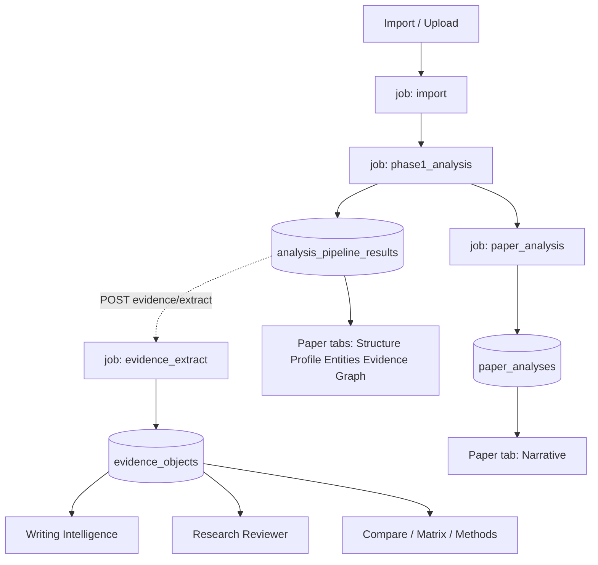

# 13 — Paper Analysis Audit (Architecture + Capability)

**Document:** `13-PAPER-ANALYSIS-AUDIT.md`  
**Mode:** Audit only (2026-08-03) — **no implementation**  
**Subsystem:** Phase 2 #21 Paper Analysis 2.0  
**Companions:** [12](12-PHASE2-COMPLETION-TRACKER.md) · [14](14-PAPER-ANALYSIS-GAP-REPORT.md) · [15](15-PAPER-ANALYSIS-IMPLEMENTATION-PLAN.md)  
**Code truth date:** main @ post-V1 (workers + `backend/analysis_pipeline` + Evidence Platform)  
**Plan revision:** See [15 v2](15-PAPER-ANALYSIS-IMPLEMENTATION-PLAN.md) — Scientific Understanding Engine; milestones 2.1–2.9

---

## 0a. Naming (product decision, 2026-08-03)

| Layer | Name |
|-------|------|
| User-facing | **Paper Analysis** |
| Internal engine | **Scientific Understanding Engine** (extends Phase 1 + LLM overview + projector) |

North Star: every imported paper becomes a **structured scientific object**, not a PDF with metadata.

---

## 0. Executive verdict

Dhund already has a **real** scientific analysis stack — not a stub:

1. **Phase 1 pipeline (1.1–1.7)** — structured, persisted per file, powering most paper workspace tabs.  
2. **LLM Paper Analysis (14 fields)** — narrative overview, worker + JWT sync paths.  
3. **Evidence extraction** — projects Phase 1 → EvidenceObjects (opt-in, not auto after upload).  
4. **Project RI** — matrix / themes / gaps / methodology / graph over EvidenceObjects.  
5. **Writing + Reviewer** — consume EvidenceObjects, **not** Narrative analysis.

The core problem for Phase 2 is **not** “missing analysis entirely.” It is:

- Dual products (Phase-1 tabs vs ungrounded Narrative) with weak FE bridge  
- Shallow / truncated LLM overview (12k chars) vs rich Phase-1 JSON  
- Medical-skewed entity depth; non-medical papers get thinner structure  
- Evidence extract not on the default upload happy path  
- Triple parse / dual LLM invoke paths (cost + drift)  
- Paper-scoped “KG” (1.7) confused with future Knowledge Graph Product  

**Paper Analysis 2.0 must deepen and unify this stack — not replace it.**

---

## 1. Architecture audit

### 1.1 End-to-end execution flow

```text
Upload / ImportAdapter / Library sync PDF
        ↓
UploadJob job_type=import          (worker._handle_import)
        ↓
imports.registry.extract_text → chunks + embeddings
        ↓
Crossref enrich (soft-fail)
        ↓
UploadJob job_type=phase1_analysis (AnalysisPipelineService 1.1–1.7)
        ↓
analysis_pipeline_results.phase_results (JSON Text)
        + bibliographic columns on files (only_empty)
        ↓
UploadJob job_type=paper_analysis  (LLM 14-field overview → paper_analyses.data)
        ↓
[OPTIONAL] evidence_extract        (NOT auto-chained today)
        ↓
evidence_objects (+ extraction runs)
        ↓
Evidence Platform APIs → Writing Intelligence → Research Reviewer → Export
```



### 1.2 Worker jobs

| Job | Handler | Role | Chains to |
|-----|---------|------|-----------|
| `import` | `_handle_import` | Extract text, chunk, embed | `phase1_analysis` |
| `extract_metadata` | `_handle_extract_metadata` | **Deprecated drain** → phase1 | `phase1_analysis` |
| `phase1_analysis` | `_handle_phase1_analysis` | Stages 1.1–1.7 + persist | `paper_analysis` |
| `paper_analysis` | `_handle_paper_analysis` | LLM 14-field JSON | — |
| `evidence_extract` | `_handle_evidence_extract` | Phase1 → EvidenceObjects | — (API-triggered) |

Registry: `worker.py` `HANDLERS`.

### 1.3 Phase 1 stages (`backend/analysis_pipeline/`)

| Stage | Key | Package | Status |
|-------|-----|---------|--------|
| 1.1 | `document_understanding` | DocumentUnderstandingPipeline | 🟢 |
| 1.2 | `classification` | DocumentClassificationPipeline | 🟢 |
| 1.3 | `analysis_context` | AnalysisContextPipeline | 🟢 |
| 1.4 | `medical_understanding` | MedicalUnderstandingPipeline (skip if non-medical) | 🟢 skip-aware |
| 1.5 | `evidence_grading` | EvidenceGradingPipeline | 🟢 |
| 1.6 | `prompt_assembly` | PromptAssemblyPipeline | 🟢 |
| 1.7 | `knowledge_graph` | KnowledgeGraphPipeline (in-process JSON, no Neo4j) | 🟡 MVP |

Orchestrator: `AnalysisPipelineService.analyze_file_path` (`PIPELINE_VERSION` stamped on row).  
Persistence: `persistence.save_analysis_result` → `analysis_pipeline_results`.

### 1.4 LLM Paper Analysis (14 fields)

| Field | Type |
|-------|------|
| executive_summary, abstract_explained, research_objective, problem_statement | string |
| methodology, dataset, experiments, results | string |
| key_contributions, strengths, limitations, future_work, keywords | string[] |
| important_terms | `{term, definition}[]` |

Plus **medical extras** when domain=`medical` (PICO, GRADE fragments, etc.) — 🟡 domain-gated.

**Paths:**

| Path | Entry | Status |
|------|-------|--------|
| Worker | `_handle_paper_analysis` + AIGateway | 🟢 |
| JWT sync | `POST /api/documents/<id>/analysis` | 🟢 |
| Legacy | `server._run_paper_analysis` | 🔴 Deprecated |

**Bottleneck:** `ANALYSIS_MAX_CHARS ≈ 12_000` — long papers truncated.

### 1.5 Evidence path

| Piece | Location | Status |
|-------|----------|--------|
| Projector | `backend/evidence/phase_projector.py` | 🟢 |
| Extract service | `extract_service.run_evidence_extraction` (v2.2.0) | 🟢 |
| API | `POST /api/projects/<id>/evidence/extract` | 🟢 |
| Auto after analysis | — | 🔴 Missing |

Evidence requires `research_ready` + non-empty Phase 1. Prefer KG claim nodes + grading; ungrounded candidates skipped.

### 1.6 Storage / tables

| Table | Content |
|-------|---------|
| `files` | Bib metadata, `content_hash`, `meta_status`, `project_id` |
| `chunks` | RAG from import |
| `upload_jobs` / `outbox_events` | Queue |
| `analysis_pipeline_results` | Phase 1.1–1.7 JSON |
| `paper_analyses` | LLM overview JSON |
| `evidence_objects` / `evidence_extraction_runs` | Project evidence |
| `derived_analyses` | Multi-paper compare/gaps |

### 1.7 Primary APIs

| Endpoint | Purpose |
|----------|---------|
| `GET /api/files/<id>/analysis` | Narrative PaperAnalysis |
| `POST /api/files/<id>/analysis/refresh` | Re-run **paper_analysis only** (skips phase1) 🟡 |
| `POST /api/documents/<id>/analyze` | Phase 1 enqueue/sync |
| `GET /api/documents/<id>/pipeline` · `/phases/<phase>` | Phase 1 read |
| `POST /api/documents/<id>/analysis` | Sync LLM overview |
| `POST /api/projects/<id>/evidence/extract` | Evidence enqueue/sync |
| Project evidence RI routes | matrix, themes, gaps, graph, methodology, … |

### 1.8 Frontend consumers

| Surface | Data source |
|---------|-------------|
| `/papers/:fileId` tabs Structure / Profile / Entities / Evidence / Graph | Phase 1 pipeline |
| Narrative tab | `paper_analyses` |
| Overview | Phase 1 signals only (Narrative **not** surfaced) |
| Related | Semantic Scholar API |
| `/research/compare` | EvidenceObjects + optional AI compare |
| Writing / Reviewer | EvidenceObjects |

---

## 2. Current capability audit

Legend: 🟢 Production · 🟡 Partial · 🔴 Missing

### 2.1 Metadata

| Capability | Status | Notes |
|------------|--------|-------|
| DOI | 🟢 | files + Crossref + Phase 1.1 |
| Title / Authors / Year / Venue / Abstract | 🟢 | |
| Journal / Publisher | 🟡 | Venue often present; publisher uneven |
| Keywords | 🟡 | LLM keywords + Phase topics; not always bib-grade |
| Affiliations | 🟡 / 🔴 | Weak / inconsistent |
| PMID | 🔴 | Not first-class (PubMed = #22) |
| References (parsed list) | 🟡 | Structure tab ReferenceBrowser; quality varies |
| References (full citation graph) | 🔴 | Related = S2 discovery, not in-paper cite map |

### 2.2 Scientific structure

| Capability | Status | Notes |
|------------|--------|-------|
| Abstract | 🟢 | Metadata + structure |
| Introduction / Methods / Results / Discussion / Conclusion sections | 🟢 | Phase 1.1 sectioning + Structure tab |
| Objectives | 🟡 | Narrative `research_objective`; not structured profile |
| Research questions | 🟡 / 🔴 | Not reliable structured field |
| Hypotheses | 🔴 | Not first-class |
| IMRaD / document profile | 🟢 | DocumentAnalysisPanel |

### 2.3 Methodology

| Capability | Status | Notes |
|------------|--------|-------|
| Study design | 🟢 | Classification + grading |
| Sample size / Population / Variables / Intervention / Controls | 🟡 | Stronger in medical 1.4; weak elsewhere |
| Dataset / Metrics / Experimental setup | 🟡 | Narrative strings + compare extract; not unified single-paper profile |
| Project methodology cards | 🟢 | RI methodology API + Methods tab |

### 2.4 Statistics

| Capability | Status | Notes |
|------------|--------|-------|
| Doc-level stats (pages/words/sections) | 🟢 | Structure tab |
| Extracted statistical findings (tests, p, CI, effect size) | 🟡 | Medical entities “statistics”; not general stats profile |
| Regression / ANOVA / Bayesian as structured | 🔴 | |

### 2.5 Evidence

| Capability | Status | Notes |
|------------|--------|-------|
| EvidenceObjects | 🟢 | Platform V1 |
| Claim extraction (from Phase 1) | 🟢 | Projector |
| Evidence linking / provenance | 🟢 | Quote + page when available |
| Evidence quality (GRADE / RoB UI) | 🟢 | Paper Evidence tab |
| Supporting / contradicting (project) | 🟢 | Consensus / conflict RI |
| Auto-extract on upload | 🔴 | Manual Extract |

### 2.6 Limitations / novelty

| Capability | Status | Notes |
|------------|--------|-------|
| Author limitations (prose) | 🟡 | Narrative list |
| Methodological limitations / threats to validity / bias | 🟡 | Grading frameworks partial; not dedicated profile |
| Novel contributions | 🟡 | Narrative `key_contributions` |
| Research gaps (paper-scoped) | 🟡 | Medical review gaps; project Gaps stronger |
| Future work | 🟡 | Narrative list |
| Incremental vs breakthrough scoring | 🔴 | |

### 2.7 Citations

| Capability | Status | Notes |
|------------|--------|-------|
| Reference parsing in structure | 🟡 | |
| Citation metadata (Related / S2) | 🟡 | Counts + lists |
| Foundational / related work intelligence | 🔴 | |
| In-text citation → reference map | 🔴 | |

### 2.8 Scientific entities

| Capability | Status | Notes |
|------------|--------|-------|
| Medical PICO / clinical entities | 🟢 | 1.4 + Entities tab |
| Concepts / methods / datasets / metrics (general) | 🟡 | Via 1.7 KG + Narrative terms |
| Diseases / chemicals / genes | 🟡 | Medical-gated |
| Algorithms / tasks / variables (general science) | 🔴 / 🟡 | Thin outside medical |

### 2.9 Relationships

| Capability | Status | Notes |
|------------|--------|-------|
| Paper-scoped edges (1.7 graph UI) | 🟡 | MVP |
| Claim → Evidence (EvidenceObjects) | 🟢 | |
| Method → Dataset (structured) | 🟡 | Compare/extract; not consistent single-paper |
| Paper → Paper / Author → Institution product | 🔴 | **KG Product / deferred** |

### 2.10 Quality assessment

| Capability | Status | Notes |
|------------|--------|-------|
| GRADE / RoB / reporting assessments | 🟢 | Evidence tab |
| Document confidence | 🟢 | Stat strip / grading |
| Holistic paper quality scorecard | 🟡 | Fragmented across tabs |
| Explainability (“why”) | 🟡 | Snippets + confidence; no PDF deep-link |
| Reproducibility signals / score | 🔴 | Plan → milestones 2.2 / 2.8 |
| Figures & tables intelligence | 🔴/🟡 | Captions sometimes in text; no first-class profile (→ 2.7) |
| Cross-paper vs project on import | 🟡 | Compare exists; not paper Overview “relative to project” (→ 2.9) |

---

## 2.11 Amendment — capabilities elevated in plan v2

Plan v2 ([15](15-PAPER-ANALYSIS-IMPLEMENTATION-PLAN.md)) elevates these as first-class SUE milestones (still paper-scoped / project-relative — **not** KG Product):

1. Richer scientific framing (problem, motivation, assumptions, scope, audience)  
2. Expanded methodology + reproducibility signals  
3. Statistics **interpretation** (grounded)  
4. EvidenceObject facet chain (methods → stats → figure → quote → confidence → limitations)  
5. Figure & Table Intelligence  
6. Cross-Paper Intelligence (paper vs project corpus)

---

## 3. Frontend audit

### 3.1 Paper workspace tabs (`/papers/:fileId`)

| Tab | Status | Notes |
|-----|--------|-------|
| Overview | 🟢 thin | Phase signals; ignores Narrative |
| Structure | 🟢 | Strong |
| Research Profile | 🟢 | Classification + context |
| Entities | 🟢 medical | Skipped UX for non-medical |
| Evidence (GRADE) | 🟢 | Naming collision with EvidenceObjects |
| Graph | 🟢 MVP | Paper-scoped 1.7 |
| Narrative | 🟡 | Ungrounded LLM essay |
| Related | 🟡 | Discovery, not citation analysis |
| Chat | 🟢 | Rail deep-links |

### 3.2 Gaps / weak UX

- Two analysis products, no bridge  
- Overview never shows exec summary / limitations from Narrative  
- No PDF page-jump from evidence snippets  
- `PaperTabPlaceholder` dead code  
- Writing export can download Narrative; Writing draft does not ingest it  

### 3.3 Project RI (`/research/compare`)

Matrix, Extract, Themes, Gaps, Graph, Timeline, Methods = 🟢 EvidenceObject-backed.  
AI Compare = 🟡 settings-gated.

---

## 4. Backend audit (extension points — no rewrites)

| Area | Location | Extend by |
|------|----------|-----------|
| Phase stages | `backend/analysis_pipeline/` | New stage package + `AnalysisOptions` flag |
| Bib fields | `extract_bibliographic_fields` + `UserFile` | Column + migration |
| LLM schema | `backend/ai/prompts.py` | Additive JSON schema fields |
| Evidence candidates | `phase_projector.py` | Preferred vs new LLM extract |
| Jobs | `worker.py` HANDLERS | New type only if needed — prefer enriching existing |
| Importers | `imports/registry.py` | New format |

**AI prompts:** `paper_analysis` in PromptRegistry + `PAPER_ANALYSIS_PROMPT`; medical variants; PromptBuilder `phase1_context=` injection.

**Do not rewrite:** Evidence contract, Writing grounded generate, Reviewer runs, frozen V1 platform APIs.

---

## 5. Evidence compatibility

| Proposed upgrade class | Compatible if… |
|------------------------|----------------|
| Richer Phase 1 JSON | Projector updated; EvidenceObject schema additive |
| Richer Narrative fields | OK if Writing still reads EvidenceObjects |
| Auto `evidence_extract` | Uses existing job + idempotent runs |
| New parallel “claims LLM” bypassing Phase 1 | ❌ Avoid |
| Breaking EvidenceObject required fields | ❌ Avoid |

Writing Intelligence + Research Reviewer remain Evidence-first. Analysis 2.0 succeeds when **better Phase 1 → better extracts → better writing**, not when Narrative dumps into the manuscript.

---

## 6. Knowledge Graph boundary

| In Paper Analysis 2.0 | Out (P5 KG Product) |
|-----------------------|---------------------|
| Improve stage 1.7 paper-scoped nodes/edges JSON | Neo4j / global research graph |
| Entity lists on the paper | Cross-corpus entity resolution product |
| Method→dataset edges **on this paper** | Author networks, institution graphs as product |
| Feed projector / paper Graph tab | Flagship KG UX / agents over OS-scale graph |

---

## 7. Research Memory boundary (future feed points only)

Mark for later — **do not implement**:

- Accepted EvidenceObjects + novelty/limitation profiles → durable project memory  
- Methodology profiles → “how we study X” memory  
- User corrections on analysis → preference memory  

Integration hook: after accept/review events, not inside Phase 1 LLM call.

---

## 8. Agent boundary (future consumers only)

Agents will compose existing jobs (`import`, `phase1_analysis`, `paper_analysis`, `evidence_extract`) and read:

- `analysis_pipeline_results`  
- `evidence_objects`  
- Project RI stages  

**Do not** add agent orchestration under #21.

---

## 9. Technical debt (blocks scale)

| Issue | Severity |
|-------|----------|
| Triple parse (import + Phase 1.1 + paper_analysis re-extract) | High |
| Dual LLM paths (worker vs JWT sync vs legacy) | High |
| 12k char truncation | High |
| `important_terms` schema drift (list vs dict legacy) | Medium |
| `analysis/refresh` skips Phase 1 | Medium |
| Duplicate prompt text (`prompts.py` vs `server._ANALYSIS_PROMPT`) | Medium |
| `extract_metadata` zombie HANDLER | Low |
| OCR gap for scanned PDFs | High (quality) |
| Token cost of full 1.1–1.7 + LLM on every paper | High |
| Weak E2E worker-chain tests without Postgres | Medium |

---

## 10. Sources (code)

- `worker.py` — HANDLERS + `_handle_*`  
- `backend/analysis_pipeline/` — service, persistence, routes, ARCHITECTURE.md  
- `backend/ai/prompts.py`, `policy.yaml`  
- `backend/evidence/phase_projector.py`, `services/extract_service.py`  
- `frontend/src/features/papers/` — tabs + overview  
- `frontend/src/features/evidence/` — compare / matrix / methodology  
- `docs/audit/01-CURRENT-ARCHITECTURE-AUDIT.md`
