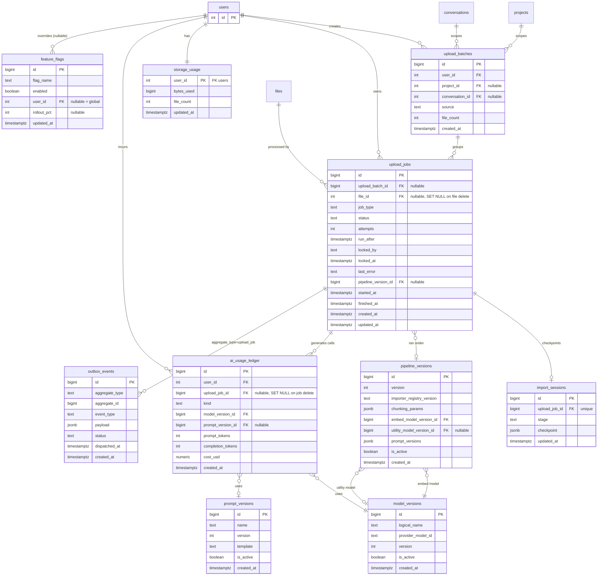

# Upload System — Production Database Design

Builds directly on [`upload-architecture.md`](./upload-architecture.md).
That doc named components (Queue Manager, Prompt Registry, Cost Ledger,
Event Bus, Distributed Locking); this doc gives them concrete schema.
Table names below are the ones requested — they map onto the prior doc's
components 1:1 (`UploadJob` = the generic `jobs` table, scoped and renamed;
`AIUsageLedger` = `ai_calls`; `OutboxEvent` makes the in-process Event Bus
transactionally durable instead of purely in-memory).

Target: Postgres (Neon, already the production DB). SQLite (`chat_dev.db`,
dev-only per `DATABASE_URL` fallback) does not support several features used
here (partial indexes work in modern SQLite, but `JSONB` and
`pg_advisory_lock` do not) — production-only schema, dev keeps today's
plain SQLite for quick local runs.

---

## 1. Complete ERD



`ProcessingMetrics` is **not** in the ERD as a table — see §2.3: it's a
materialized view over `upload_jobs`, not a maintained table. The source
data already exists; a view is less code than a table that needs its own
write path kept in sync.

---

## 2. Table definitions

### 2.1 `upload_batches`

Groups files uploaded together in one user action (drag five PDFs at once,
upload a folder). Today's frontend loops one `POST /api/files` call per
file (`Composer.tsx handleFiles`) — there is currently no batch concept at
all; this is genuinely new, not a rename.

```sql
CREATE TABLE upload_batches (
    id              bigserial PRIMARY KEY,
    user_id         integer NOT NULL REFERENCES users(id) ON DELETE CASCADE,
    project_id      integer REFERENCES projects(id) ON DELETE SET NULL,
    conversation_id integer REFERENCES conversations(id) ON DELETE SET NULL,
    source          text NOT NULL DEFAULT 'library',   -- 'library' | 'chat_composer' | 'folder_drop'
    file_count      integer NOT NULL DEFAULT 0,
    created_at      timestamptz NOT NULL DEFAULT now()
);
```

### 2.2 `upload_jobs`

The queue row. One per pipeline stage per file — an upload of one PDF
produces up to 3 rows over its lifetime: `import`, `extract_metadata`,
`paper_analysis` (matches the 3 non-import background tasks named in the
architecture audit; `memory_extraction`/`compare`/`gaps` reuse the same
table with their own `job_type`, not separate tables — one polymorphic
queue, not five near-identical ones).

```sql
CREATE TABLE upload_jobs (
    id                  bigserial PRIMARY KEY,
    upload_batch_id     bigint REFERENCES upload_batches(id) ON DELETE SET NULL,
    file_id             integer REFERENCES files(id) ON DELETE SET NULL,
    job_type            text NOT NULL,                  -- import | extract_metadata | paper_analysis | memory_extraction | compare | gap_finder
    status              text NOT NULL DEFAULT 'pending', -- pending | running | done | failed
    attempts            integer NOT NULL DEFAULT 0,
    run_after           timestamptz NOT NULL DEFAULT now(),
    locked_by           text,
    locked_at           timestamptz,
    last_error          text,
    pipeline_version_id bigint REFERENCES pipeline_versions(id),
    started_at          timestamptz,
    finished_at         timestamptz,
    created_at          timestamptz NOT NULL DEFAULT now(),
    updated_at          timestamptz NOT NULL DEFAULT now(),
    CONSTRAINT chk_upload_jobs_status
        CHECK (status IN ('pending','running','done','failed'))
);
```

`file_id` is `ON DELETE SET NULL`, not `CASCADE`: a job row is an audit/
history record (what ran, when, under which pipeline version) — deleting
the source file shouldn't erase that history, only its link to it.

### 2.3 `ProcessingMetrics` — materialized view, not a table

The data it needs (duration, chunk/page counts, success/failure) already
lives on `upload_jobs`. Maintaining a separate hand-written rollup table
means a second write path that can drift from the source; a materialized
view reads directly from the table that's already the source of truth.

```sql
CREATE MATERIALIZED VIEW processing_metrics_daily AS
SELECT
    date_trunc('day', created_at)                    AS bucket_date,
    job_type,
    count(*)                                          AS jobs_count,
    count(*) FILTER (WHERE status = 'done')           AS success_count,
    count(*) FILTER (WHERE status = 'failed')         AS failure_count,
    avg(extract(epoch FROM (finished_at - started_at)) * 1000)
        FILTER (WHERE finished_at IS NOT NULL)        AS avg_duration_ms
FROM upload_jobs
GROUP BY 1, 2;

CREATE UNIQUE INDEX ix_processing_metrics_daily
    ON processing_metrics_daily (bucket_date, job_type);
```

Refresh via `REFRESH MATERIALIZED VIEW CONCURRENTLY processing_metrics_daily`
on a schedule — the natural way to schedule it is an `upload_jobs` row of
its own (`job_type = 'refresh_metrics'`, re-enqueued daily), reusing the
Queue Manager for its own housekeeping instead of adding a separate cron
mechanism.

*If per-user (not just per-day/job_type) breakdown turns out to be needed
for a dashboard, add `user_id` to the `GROUP BY` — noting it here as the
one place this view would need to grow, not building it in speculatively.*

### 2.4 `storage_usage`

Unlike metrics, this **must** be a live table, not a view: quota
enforcement needs an answer before accepting an upload, synchronously, not
after tonight's refresh.

```sql
CREATE TABLE storage_usage (
    user_id     integer PRIMARY KEY REFERENCES users(id) ON DELETE CASCADE,
    bytes_used  bigint NOT NULL DEFAULT 0,
    file_count  integer NOT NULL DEFAULT 0,
    updated_at  timestamptz NOT NULL DEFAULT now()
);
```

Updated by the Upload Manager (`UPDATE storage_usage SET bytes_used =
bytes_used + :size, file_count = file_count + 1 WHERE user_id = :uid`) and
by file deletion (decrement) — same transaction as the `files` row change,
so it can never drift from reality.

### 2.5 `ai_usage_ledger`

```sql
CREATE TABLE ai_usage_ledger (
    id                bigserial PRIMARY KEY,
    user_id           integer NOT NULL REFERENCES users(id) ON DELETE CASCADE,
    upload_job_id     bigint REFERENCES upload_jobs(id) ON DELETE SET NULL,
    kind              text NOT NULL,       -- chat | embedding | metadata | analysis | compare | gaps
    model_version_id  bigint NOT NULL REFERENCES model_versions(id),
    prompt_version_id bigint REFERENCES prompt_versions(id),
    prompt_tokens     integer NOT NULL DEFAULT 0,
    completion_tokens integer NOT NULL DEFAULT 0,
    cost_usd          numeric(10,6) NOT NULL DEFAULT 0,
    created_at        timestamptz NOT NULL DEFAULT now()
);
```

`upload_job_id` nullable and `SET NULL`: plain chat calls (no upload
involved) and deleted jobs must never delete their cost row — this is a
financial/audit record, it must outlive both the job and, transitively,
the file.

### 2.6 `prompt_versions`

```sql
CREATE TABLE prompt_versions (
    id         bigserial PRIMARY KEY,
    name       text NOT NULL,       -- 'paper_analysis' | 'extract_metadata' | 'compare' | 'gap_finder' | 'chat_system'
    version    integer NOT NULL,
    template   text NOT NULL,
    is_active  boolean NOT NULL DEFAULT false,
    created_at timestamptz NOT NULL DEFAULT now(),
    UNIQUE (name, version)
);

-- exactly one active version per prompt name
CREATE UNIQUE INDEX ix_prompt_versions_active
    ON prompt_versions (name) WHERE is_active;
```

### 2.7 `model_versions`

Tracks *our* versioning of a model choice (so "which model produced this
row" survives an env var change), not OpenAI's own model IDs directly.

```sql
CREATE TABLE model_versions (
    id                 bigserial PRIMARY KEY,
    logical_name       text NOT NULL,   -- 'default_model' | 'utility_model' | 'embed_model'
    provider_model_id  text NOT NULL,   -- e.g. 'gpt-4o-mini'
    version            integer NOT NULL,
    is_active          boolean NOT NULL DEFAULT false,
    created_at         timestamptz NOT NULL DEFAULT now(),
    UNIQUE (logical_name, version)
);

CREATE UNIQUE INDEX ix_model_versions_active
    ON model_versions (logical_name) WHERE is_active;
```

### 2.8 `pipeline_versions`

A single addressable bundle: "what exactly produced this file's chunks and
analysis." Deliberately a JSONB snapshot for the prompt map rather than a
join table — pipeline versions are created rarely (on deploy, when a
prompt or chunking param changes) and always read as one whole bundle,
never queried prompt-by-prompt. Normalizing that into a many-to-many table
would add joins with no query that ever needs them.

```sql
CREATE TABLE pipeline_versions (
    id                        bigserial PRIMARY KEY,
    version                   integer NOT NULL UNIQUE,
    importer_registry_version text NOT NULL,        -- e.g. git tag / semver of imports/ package
    chunking_params           jsonb NOT NULL,        -- {"size": 1500, "overlap": 200}
    embed_model_version_id    bigint NOT NULL REFERENCES model_versions(id),
    utility_model_version_id  bigint REFERENCES model_versions(id),
    prompt_versions           jsonb NOT NULL,        -- {"paper_analysis": 3, "extract_metadata": 2}
    is_active                 boolean NOT NULL DEFAULT false,
    created_at                timestamptz NOT NULL DEFAULT now()
);

CREATE UNIQUE INDEX ix_pipeline_versions_active
    ON pipeline_versions (is_active) WHERE is_active;
```

### 2.9 `import_sessions`

Resumable checkpoint for a long-running import — distinct from
`upload_jobs`, which tracks *attempt* lifecycle (pending/running/done/
failed). If embedding batch 6 of 10 fails, the session remembers batch 6
was reached so a retry resumes instead of re-embedding 1-5 and re-billing
for them.

```sql
CREATE TABLE import_sessions (
    id             bigserial PRIMARY KEY,
    upload_job_id  bigint NOT NULL UNIQUE REFERENCES upload_jobs(id) ON DELETE CASCADE,
    stage          text NOT NULL,      -- extract | chunk | embed
    checkpoint     jsonb NOT NULL DEFAULT '{}',  -- {"embedded_count": 40, "total": 100}
    updated_at     timestamptz NOT NULL DEFAULT now()
);
```

`ON DELETE CASCADE` here (unlike `upload_jobs.file_id`): a session is
meaningless without its job, it's a checkpoint *for* that job, not an
independent audit record.

### 2.10 `outbox_events`

Makes the Event Bus from the architecture doc transactionally consistent:
today's `upload_file()` commits the DB row *then* calls
`threading.Thread(...).start()` — if the process dies between those two
lines, the event is silently lost. Writing the event in the **same
transaction** as the state change closes that gap; a relay drains the
table exactly like the `upload_jobs` worker does.

```sql
CREATE TABLE outbox_events (
    id             bigserial PRIMARY KEY,
    aggregate_type text NOT NULL,     -- 'upload_job' | 'upload_batch' | ...
    aggregate_id   bigint NOT NULL,   -- polymorphic — no FK (see §5 constraints)
    event_type     text NOT NULL,     -- 'file.imported' | 'analysis.done' | ...
    payload        jsonb NOT NULL,
    status         text NOT NULL DEFAULT 'pending',  -- pending | dispatched | failed
    dispatched_at  timestamptz,
    created_at     timestamptz NOT NULL DEFAULT now()
);
```

### 2.11 `feature_flags`

```sql
CREATE TABLE feature_flags (
    id          bigserial PRIMARY KEY,
    flag_name   text NOT NULL,
    enabled     boolean NOT NULL DEFAULT false,
    user_id     integer REFERENCES users(id) ON DELETE CASCADE,  -- null = global default
    rollout_pct smallint,           -- optional gradual rollout, null = all-or-nothing
    updated_at  timestamptz NOT NULL DEFAULT now()
);
```

Per §11 of the architecture doc: **build this table when the first real
flag is needed** (e.g. rolling the queue-based upload path out gradually),
not speculatively ahead of it. Schema is here so it's ready the day that
happens.

---

## 3. Constraints — the ones worth calling out

Most FKs/NOT NULLs are inline above; these are the non-obvious ones:

1. **`feature_flags` uniqueness is two partial indexes, not one plain
   `UNIQUE(flag_name, user_id)`.** Postgres treats `NULL <> NULL`, so a
   naive composite unique constraint would let the same global
   (`user_id IS NULL`) flag be inserted twice. Fixed with:

   ```sql
   CREATE UNIQUE INDEX ix_feature_flags_global
       ON feature_flags (flag_name) WHERE user_id IS NULL;
   CREATE UNIQUE INDEX ix_feature_flags_per_user
       ON feature_flags (flag_name, user_id) WHERE user_id IS NOT NULL;
   ```

2. **Exactly one active row** is enforced at the DB level (not just in
   application code) for `prompt_versions`, `model_versions`, and
   `pipeline_versions` via partial unique indexes on `is_active` — a bad
   deploy script can't leave two "active" prompt versions for the same
   name.

3. **`outbox_events.aggregate_id` has no FK.** It's a polymorphic
   reference (`aggregate_type` says which table `aggregate_id` points
   into) — Postgres can't express a conditional FK across multiple target
   tables. This is a known, accepted gap for outbox tables generally:
   integrity here is enforced by the writer (always insert in the same
   transaction as the aggregate change), not by the schema.

4. **Financial/audit rows never cascade-delete with their subject.**
   `ai_usage_ledger.upload_job_id` and `upload_jobs.file_id` are both
   `ON DELETE SET NULL`. A user deleting a file must not be able to erase
   the cost record of the API calls that were already made against it.

---

## 4. Indexes

| Table | Index | Serves |
|---|---|---|
| `upload_batches` | `(user_id, created_at DESC)` | "my recent uploads" list |
| `upload_jobs` | `(status, run_after) WHERE status='pending'` | worker poll query (`FOR UPDATE SKIP LOCKED`) — the single most important index in this schema |
| `upload_jobs` | `(file_id)` | "all jobs for this file" (status polling from the frontend) |
| `upload_jobs` | `(upload_batch_id)` | batch progress rollup |
| `import_sessions` | `UNIQUE(upload_job_id)` | 1:1 lookup + enforces the relationship |
| `ai_usage_ledger` | `(user_id, created_at DESC)` | per-user cost dashboard |
| `ai_usage_ledger` | `(model_version_id)` | cost-by-model reporting |
| `prompt_versions` | `UNIQUE(name, version)`, partial `UNIQUE(name) WHERE is_active` | version lookup + single-active enforcement |
| `model_versions` | `UNIQUE(logical_name, version)`, partial `UNIQUE(logical_name) WHERE is_active` | same pattern |
| `pipeline_versions` | `UNIQUE(version)`, partial `UNIQUE(is_active) WHERE is_active` | same pattern |
| `outbox_events` | `(status, created_at) WHERE status='pending'` | relay poll query, same `SKIP LOCKED` pattern as `upload_jobs` |
| `feature_flags` | two partial uniques (§3.1) | correctness, not just performance |
| `processing_metrics_daily` | `UNIQUE(bucket_date, job_type)` | required for `REFRESH ... CONCURRENTLY` |

---

## 5. Redis schema

The architecture doc deliberately avoided adding Redis for the queue
(Postgres `SKIP LOCKED` covers it). Redis earns its place here for a
narrower set of things Postgres is a poor fit for: sub-second ephemeral
state and the rate limiter the codebase **already flags as needing it**
(`flask_limiter` currently runs on `storage_uri="memory://"` with a comment
saying *"switch to redis:// for multi-process production"* — this is that
switch, not a new idea).

| Key pattern | Type | TTL | Purpose |
|---|---|---|---|
| `ratelimit:{scope}:{key}` | string (counter) | window-based (flask-limiter manages) | Replaces `memory://` — correct under `gunicorn -w 2+` |
| `lock:{name}` | string, `SET NX PX` | lock-specific (e.g. 30s) | TTL-based mutual exclusion for singleton tasks (e.g. model-list cache refresh) — an alternative to `pg_advisory_lock` for cases where a crashed holder must auto-release rather than hold until its DB connection closes |
| `job:{id}:status` | hash `{status, progress, updated_at}` | 1h | Fast read target for the frontend's status polling (today's `refetchInterval` hits Postgres directly every few seconds per open tab; this fronts it with a cache, refreshed by the worker each time it updates `upload_jobs`) |
| `dedupe:upload:{content_hash}` | string (job id) | 5 min | Guards a double-click / double-submit from enqueueing two `import` jobs for the same content before the first has written its row |
| `models:list:cache` | string (JSON) | 10 min | Same TTL/shape as today's in-process `_model_cache`, moved out of process memory so it's shared across `gunicorn` workers instead of each worker hitting `/v1/models` independently |

None of these are the system of record — every one of them is either
reconstructable from Postgres or genuinely fine to lose (a cache miss just
means one extra Postgres read or one extra `/v1/models` call). That's the
intended boundary: **Postgres owns durability, Redis owns speed.**

---

## 6. Migrations

No Alembic today — `ensure_columns()` runs a hardcoded list of
`ALTER TABLE ... ADD COLUMN` wrapped in try/except-swallow, on every boot.
Reuse that shape rather than introducing a new migration framework
speculatively (Alembic scaffolding — `alembic.ini`, `env.py`, revision
graph — is real overhead this project hasn't needed so far). The one
genuine gap in today's approach: nothing records *which* migrations have
already run — it relies entirely on "duplicate column" errors being safe
to ignore, forever. Fix that gap directly instead of swapping frameworks:

```sql
CREATE TABLE schema_migrations (
    version     text PRIMARY KEY,
    applied_at  timestamptz NOT NULL DEFAULT now()
);
```

Each migration is a numbered `.sql` file; a tiny runner (a dozen lines,
not a framework) applies any file whose name isn't yet in
`schema_migrations`, in one transaction each:

```
migrations/
  0001_upload_batches.sql
  0002_upload_jobs.sql
  0003_import_sessions.sql
  0004_storage_usage.sql
  0005_prompt_model_pipeline_versions.sql
  0006_ai_usage_ledger.sql
  0007_outbox_events.sql
  0008_feature_flags.sql
  0009_processing_metrics_daily_view.sql
```

Ordered so every file only references tables created by an earlier one
(e.g. `0006` comes after `0005` because `ai_usage_ledger` FKs into
`model_versions`/`prompt_versions`).

---

## 7. Backfill strategy

Table by table — what historical data exists to backfill from, and what
honestly doesn't:

- **`upload_batches`** — no historical equivalent. The current frontend
  uploads one file per request even when several are dropped at once
  (`Composer.tsx` loops `filesApi.upload` per file) — there was never a
  batch. Leave `upload_jobs.upload_batch_id` `NULL` for pre-cutover jobs
  rather than fabricating batches that didn't happen.

- **`upload_jobs`** — backfill one synthetic `done` row per existing
  `files` row that finished processing, using existing timestamps as the
  best available proxy (exact start/end timing was never recorded):

  ```sql
  INSERT INTO upload_jobs (file_id, job_type, status, started_at, finished_at, created_at)
  SELECT id, 'import', 'done', created_at, created_at, created_at
  FROM files WHERE text_len > 0;

  INSERT INTO upload_jobs (file_id, job_type, status, started_at, finished_at, created_at)
  SELECT id, 'extract_metadata', meta_status, created_at, created_at, created_at
  FROM files WHERE meta_status IN ('done','failed');
  ```

- **`import_sessions`** — not backfillable, and not meaningful to: no
  checkpoint history exists for already-completed imports. Skip entirely;
  existing files are implicitly "fully imported, no session needed."

- **`storage_usage`** — directly backfillable, it's just a `SUM`:

  ```sql
  INSERT INTO storage_usage (user_id, bytes_used, file_count)
  SELECT user_id, sum(size), count(*) FROM files GROUP BY user_id;
  ```

- **`ai_usage_ledger`** — **not backfillable.** The audit confirmed token
  usage from every past OpenAI response was read for its text and
  discarded — that data no longer exists anywhere. State this plainly
  rather than fabricating estimates: historical cost is unrecoverable, the
  ledger starts empty at cutover, and that's a known gap, not a backfill
  bug.

- **`prompt_versions`** — seed version 1 = the current literal prompt
  strings, copied verbatim from `_META_PROMPT` / `_ANALYSIS_PROMPT` / the
  compare and gap-finder prompts / the chat system prompt, each marked
  `is_active = true`. This is the "as-is" starting point, not a rewrite.

- **`model_versions`** — seed version 1 per logical name from the current
  env vars (`DEFAULT_MODEL`, `UTILITY_MODEL`, `EMBED_MODEL`), each
  `is_active = true`.

- **`pipeline_versions`** — seed version 1 composing the two seeds above;
  backfill existing `paper_analyses` rows' *conceptual* pipeline to
  version 1 (there's no column to backfill on `paper_analyses` itself
  unless it's also given a `pipeline_version_id` FK as part of this
  migration — add it nullable, default to pipeline v1 for all
  pre-cutover rows).

- **`outbox_events`** — no backfill. Purely forward-looking; starts empty.

- **`feature_flags`** — no backfill, and no flags seeded, per §2.11 and
  the architecture doc's explicit recommendation to defer this until a
  real flag is needed.
