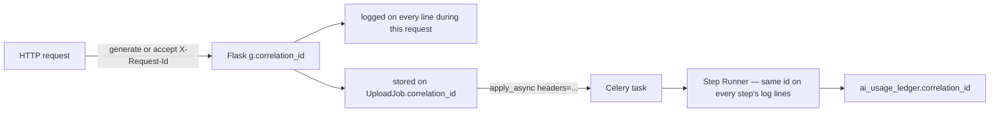

# Everything DevOps — Observability & Operations Architecture

Scope: closing the observability gap the earlier docs kept bumping into.
`upload-architecture.md` §1.3 already flagged there's no cost visibility
and no structured logs; `database-design.md` already built the durable
tables (`ai_usage_ledger`, `storage_usage`) this doc puts a dashboard on
top of. Design only, same format as the rest of the series.

**The throughline**: most of these 11 deliverables are not new systems.
Four are dashboards over tables the last two docs already designed. Two
("Worker Dashboard", parts of "Queue Dashboard") are a well-known
off-the-shelf tool, not something to build. The genuinely new work is
narrow: a metrics-collection middleware, a correlation ID, and JSON log
formatting — all three are a few dozen lines each, not new services.

---

## 1. Metrics — the collection mechanism

One library choice underlies every dashboard below: `prometheus_client`
(a Python library, not a new hosted service — it just exposes a
`/metrics` endpoint that's plain-text and human-`curl`-able on its own,
Grafana is optional polish on top, not a prerequisite). Chosen over a
hosted APM (Datadog/New Relic) because those are ongoing paid services
for a personal-scale app that doesn't need vendor-grade tracing yet — the
metrics themselves matter, not whose SaaS renders them.

Three primitive types cover everything in this doc:

```python
http_requests_total       = Counter("http_requests_total", ["method", "route", "status"])
http_request_duration     = Histogram("http_request_duration_seconds", ["method", "route"])
storage_bytes_used        = Gauge("storage_bytes_used", ["provider"])
ai_usage_cost_usd_total   = Counter("ai_usage_cost_usd_total", ["model", "kind"])
cache_hits_total          = Counter("cache_hits_total", ["cache_name"])
cache_misses_total        = Counter("cache_misses_total", ["cache_name"])
```

Wired via one `before_request`/`after_request` pair in `server.py` for
the HTTP-level metrics, and one increment call at each specific point of
interest (a cache hit, a job status change) for the rest.

**Why this doesn't replace `ai_usage_ledger` / `storage_usage`, and isn't
redundant with them either**: Postgres and Prometheus are good at
opposite query shapes. Postgres answers *"every AI call user 42 made in
the last 90 days, with full detail"* — durable, arbitrary-dimension,
audit-grade. Prometheus answers *"requests/sec over the last 10 minutes
at 15-second resolution"* — cheap, real-time, built for graphing and
alerting, and expected to lose old detail (downsampled/expired) because
that's not its job. Both are needed; neither substitutes for the other.

---

## 2. Structured Logging + Correlation IDs

Today: `logging.basicConfig(format="%(asctime)s %(levelname)s %(name)s:
%(message)s")` — plain text, no request identity attached to a line, no
way to grep "everything that happened for this one upload" out of the
log stream. Fixed together because a correlation ID is only useful if
every log line actually carries it.

**Correlation ID lifecycle** — generated once, carried through every
hop, including the ones that cross a process boundary into Celery:



```python
@app.before_request
def assign_correlation_id():
    g.correlation_id = request.headers.get("X-Request-Id") or uuid.uuid4().hex
```

- Stored as a new nullable `correlation_id` column on `upload_jobs` and
  `ai_usage_ledger` (both already exist in `database-design.md`) — a
  one-line migration, not a new table.
- Passed into Celery via `apply_async(headers={"correlation_id":
  g.correlation_id})`, read back inside the task via `self.request.headers
  .get("correlation_id")`, so the id survives the HTTP→worker hop where a
  thread-local or Flask `g` cannot.
- **JSON log formatting is stdlib, not a new dependency**
  (`python-json-logger` exists but a custom `logging.Formatter` is ~10
  lines and this app has no other structured-logging need that would
  justify a dependency for it):

  ```python
  class JsonFormatter(logging.Formatter):
      def format(self, record):
          return json.dumps({
              "ts": self.formatTime(record, "%Y-%m-%dT%H:%M:%S"),
              "level": record.levelname,
              "logger": record.name,
              "message": record.getMessage(),
              "correlation_id": getattr(record, "correlation_id", None),
              "user_id": getattr(record, "user_id", None),
          })
  ```

  A `logging.Filter` attached once, at handler setup, injects
  `correlation_id`/`user_id` from `g` onto every record automatically —
  call sites don't change at all.

---

## 3. AI Metrics (and where the Cost Ledger deliverable actually lives)

The Cost Ledger itself needs no new design — `database-design.md` §2.5
already fully specifies `ai_usage_ledger`. What's missing is the
dashboard layer, and the right pattern for it is the one
`database-design.md` §2.3 already used for `processing_metrics_daily`: a
**materialized view**, not a hand-maintained rollup table, because the
source rows already exist and a second write path would just be a second
place for the numbers to drift from the first.

```sql
CREATE MATERIALIZED VIEW ai_cost_daily AS
SELECT date_trunc('day', created_at) AS bucket_date,
       model_version_id, kind,
       count(*)                       AS calls,
       sum(prompt_tokens)             AS prompt_tokens,
       sum(completion_tokens)         AS completion_tokens,
       sum(cost_usd)                  AS cost_usd
FROM ai_usage_ledger
GROUP BY 1, 2, 3;
```

The Prometheus counter (`ai_usage_cost_usd_total`, §1) is incremented
alongside every `ai_usage_ledger` insert — same call site, two cheap
writes, serving the two different query shapes from §1.

---

## 4. Storage Metrics

Three data sources, none new:

1. **`storage_usage`** (`database-design.md` §2.4) — live per-user
   bytes/file-count; exposed as-is, `storage_bytes_used` Gauge kept in
   sync on the same write path that already updates the table.
2. **GC / reconciliation reports** — already produced today by the
   `gc-storage` / `reconcile-storage` CLI commands built in the storage
   implementation pass. The dashboard just needs those runs to log their
   `GCReport`/`ReconcileReport` counts as metrics instead of only
   `click.echo` output, so a trend ("orphan count creeping up") is
   visible over time instead of only in whoever's terminal ran the
   command.
3. **Upload success/failure** — `http_requests_total` filtered to the
   `/api/uploads/*` and `/api/files` routes, already covered by §1's
   generic HTTP metrics with no extra instrumentation.

---

## 5. Cache Metrics

Two cache boundaries already exist in the codebase as of the storage
implementation pass and the fixed key in `research-intelligence.md` §6 —
this section just counts hits/misses at each:

- **Upload-level dedup** (`_find_duplicate_file`, ships a
  `duplicate: true` response today) — every call is a hit or a miss;
  `cache_hits_total{cache_name="upload_dedup"}` /
  `cache_misses_total{...}` at that exact call site.
- **Analysis idempotency** (`content_hash` + `pipeline_version_id`,
  `research-intelligence.md` §6) — same pattern, `cache_name=
  "paper_analysis"` / `"derived_analysis"`.

No new cache layer to instrument — both short-circuits already exist in
the running code; this is two counter increments added at points that
already decide hit-vs-miss, not new logic.

---

## 6. Queue Dashboard

Reuses `processing_metrics_daily` (`database-design.md` §2.3) almost
entirely — that view already rolls up `upload_jobs` by day and
`job_type` with success/failure counts and average duration. What it
doesn't cover: **current** state (today's queue depth, not yesterday's
history) and per-`job_type` failure detail. Both are direct queries
against `upload_jobs`, not a new table:

```sql
-- live queue depth by type and status
SELECT job_type, status, count(*) FROM upload_jobs GROUP BY 1, 2;

-- oldest pending job per queue — is anything stuck at the front?
SELECT job_type, min(created_at) FROM upload_jobs
WHERE status = 'pending' GROUP BY 1;
```

The dead-letter view (`processing-pipeline-architecture.md` §7,
`status='failed'`) is a tab here too — same table, same query shape.

---

## 7. Worker Dashboard — this one is "deploy Flower," not "build a UI"

Celery already ships the exact thing this deliverable asks for: worker
liveness, active/reserved task counts, per-task timing, rate limiting
controls — via `celery inspect` and the `flower` package (Celery's
standard companion web UI, actively maintained, purpose-built for
exactly this). Building a custom worker dashboard would mean
re-implementing Flower, worse. Deployment is one more long-running
process (`celery -A celery_app flower --port=5555`), gated behind the
same admin auth as the rest of this doc (§9) via a reverse-proxy rule,
not a rewrite of Flower's own UI.

---

## 8. Performance dashboards

The `http_request_duration_seconds` Histogram from §1, visualized as
p50/p95/p99 per route. This is the one deliverable that's genuinely "add
a new capability" rather than "view existing data" — but the capability
is the §1 middleware, already designed; this section is just confirming
what it's *for*. Grafana is the natural place to graph it, but isn't a
prerequisite: `/metrics` is plain text and directly readable without
standing up a dashboard at all, which is a fine starting point before
committing to a Grafana deployment.

---

## 9. Admin Dashboard — the umbrella, not a 6th separate app

§§4-8 are **tabs in one authenticated page**, not five standalone URLs to
remember and separately secure. Consolidating them is the actual design
decision here, not a detail:

```
/admin
  /admin/queue         — §6, upload_jobs live state + DLQ
  /admin/workers        — §7, embeds/links to Flower
  /admin/storage         — §4, storage_usage + GC/reconcile trends
  /admin/cache             — §5, hit/miss rates
  /admin/ai-cost            — §3, ai_cost_daily
  /admin/performance          — §8, request latency percentiles
```

**Gating**: reuse the exact pattern `ALLOWED_EMAILS` already establishes
(`server.py` config, comma-separated env var) rather than introducing a
new role/permission system for what's a single-owner or small-team app —
`ADMIN_EMAILS`, checked the same way, no new DB column, no RBAC table.

---

## 10. Summary — what's actually new here

| New infrastructure | New code, existing data | Reuse / off-the-shelf |
|---|---|---|
| `prometheus_client` middleware (§1) | `ai_cost_daily` materialized view (§3) | Cost Ledger schema — already designed |
| Correlation ID + JSON logging (§2) | Cache hit/miss counters (§5) | `storage_usage` / GC reports — already exist |
| Admin Dashboard shell (§9) | Queue live-state queries (§6) | Worker Dashboard = **Flower**, not custom-built |

Same close as the rest of the series: design only — say the word for the
implementation pass.
