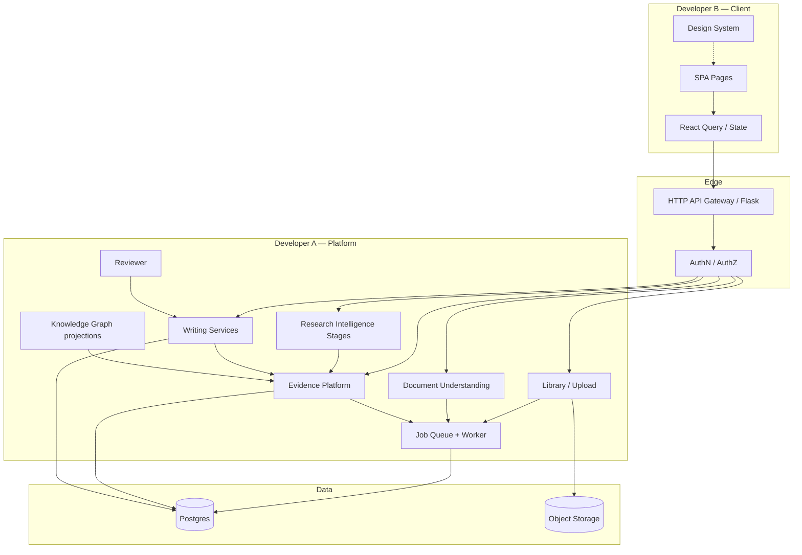

# IDD-0001 — System Architecture

| Field | Value |
|-------|-------|
| **Status** | Proposed — Pending dual-team approval |
| **Authors** | Principal Architecture (Dhund) |
| **Audience** | Developer A (Backend/AI), Developer B (Frontend/Design) |
| **Supersedes** | Informal API usage; complements ADRs 0001–0007 |
| **Related** | [IDD-0002](./IDD-0002-Domain-Model.md) … [IDD-0010](./IDD-0010-Future-Extensions.md) · `docs/00-constitution.md` · `Now-Status/04-IDD.md` |

---

## 1. Executive Summary

### 1.1 Purpose

This Interface Definition Document (IDD) pack is the **single source of truth** for contracts between Dhund’s backend and frontend. After approval:

- **Developer A** implements persistence, workers, Evidence Layer, retrieval, and HTTP APIs against these contracts.
- **Developer B** implements UI, design system, and client state against the same contracts (using mocks until live).
- Neither engineer blocks the other on implementation details—**only contracts matter**.

### 1.2 Goals

1. Enable **months of parallel work** with minimal sync points.
2. Encode Dhund’s identity as a **Research Operating System**, not a chat app.
3. Freeze **Evidence-first** dependency rules so no feature bypasses Evidence Objects.
4. Align contracts with **existing shipped architecture** (SQLAlchemy, Postgres worker, Evidence APIs)—evolve, do not rewrite.
5. Provide naming, versioning, error, and DoD rules suitable for production SaaS.

### 1.3 Non-goals

- Implementation code, SQL migrations, or React components in this pack.
- Redesigning well-architected seams (Postgres queue, EvidenceObject, factory/DI).
- Specifying vendor SDKs, cloud regions, or UI pixel values (those live in Figma / design tokens).
- Multi-tenant teams, billing processors, or Celery (deferred; see IDD-0010).

### 1.4 Engineering principles

| # | Principle | Implication |
|---|-----------|-------------|
| P1 | **Evidence First** | Intelligent features consume Evidence Objects—not raw PDF bytes or unscoped LLM calls. |
| P2 | **Contract-first** | OpenAPI-shaped APIs + TypeScript interfaces land before feature UI/logic merges. |
| P3 | **Evolve, don’t rewrite** | Prefer extending existing tables/routes; breaking changes require ADR + IDD revision. |
| P4 | **Modular monolith** | Clear module boundaries; no `import server` from packages loaded by the app entrypoint. |
| P5 | **Async for heavy work** | Upload, extract, analysis → jobs; UI polls or subscribes to job status. |
| P6 | **Human control** | Accept/reject evidence; Reviewer findings are advisory until user acts. |
| P7 | **Ownership always** | Every resource is scoped to `user_id` and usually `project_id`. |
| P8 | **Observability** | Version stamps on Evidence, Writing, Reviewer outputs. |

### 1.5 Assumptions

1. Auth is session cookie (SPA) and/or Bearer JWT (upload/pipeline); both map to the same `User`.
2. Library paper identity is the `files` row (**Paper** in domain language)—no parallel `papers` table.
3. Postgres is system of record; Redis job-status cache is optional and non-authoritative.
4. Marketing site (Jinja) is out of SPA scope; this IDD covers the **authenticated application**.

### 1.6 Risks

| Risk | Mitigation |
|------|------------|
| Contract drift vs live code | Phase 1: dual-run validation; CI contract tests (IDD-0009) |
| Over-speculating future entities | Mark speculative fields `optional` / `future`; see IDD-0010 |
| Frontend blocked on AI latency | Job-based APIs + mock fixtures for all Evidence stages |
| Dual upload stacks during transition | Façade routes keep stable paths (IDD-0003) |

---

## 2. System Architecture

### 2.1 High-level diagram



### 2.2 Pipeline (product spine)

```text
PDF / Import
    → Document Understanding
    → Evidence Objects
    → Evidence Retrieval
    → Evidence Ranking
    → Reasoning
    → Writing Workspace
    → Reviewer
    → Export
```

**Hard rule:** No stage after Document Understanding may treat raw PDF text as the knowledge source of record. Downstream stages read **Evidence Objects** (and Writing Documents for manuscript state).

### 2.3 Major modules and responsibilities

| Module | Owner | Responsibility | Must not |
|--------|-------|----------------|----------|
| **Identity** | A | Users, sessions, JWT, beta invites | Own research knowledge |
| **Projects** | A+B | Workspace scoping | Store evidence blobs in project JSON |
| **Library** | A+B | Import, organize Papers, Research Ready | Call LLM for claims |
| **Document Understanding** | A | Parse, structure, Phase-1 analysis | Bypass queue for heavy work |
| **Evidence Platform** | A | Extract, store, review, explain Evidence Objects | Invent evidence without anchors |
| **Research Intelligence** | A | Retrieve, rank, consensus, conflict, reason | Accept prompt/model in EvidenceQuery |
| **Writing Studio** | A+B | Documents, sections, bindings, grounded draft | Generate without evidence scope |
| **Reviewer** | A+B | Findings on drafts | Silently mutate manuscript |
| **Export** | A+B | Packaged outputs with provenance | Drop citation/evidence links |
| **Search** | A+B | Library / paper / evidence / project search | Rank by opaque LLM preference alone |
| **Prompt Engine** | A | Model routing, prompts, cost | Be called from UI with free-form “do research” |

### 2.4 Boundaries

```text
Frontend  ──HTTP contracts only──►  API
API       ──service interfaces──►  Domain modules
Domain    ──repositories/ORM────►  Postgres / Object storage
Worker    ──same domain services─►  Postgres (peer process)
```

- Frontend **never** imports backend modules.
- Frontend **never** embeds provider API keys or model IDs for research generation.
- Backend **never** depends on React routes or Figma.

### 2.5 Dependency direction

```text
UI → API → Services → Persistence
         ↘ Worker → Services → Persistence
```

Forbidden reverse dependencies: Persistence → API; Worker → Frontend; Evidence → raw PDF as SoT.

### 2.6 Naming conventions

| Layer | Convention | Example |
|-------|------------|---------|
| Domain entity | PascalCase | `EvidenceObject` |
| API route | kebab-case plural nouns | `/api/evidence-objects` *(aliases may keep legacy paths—see IDD-0003)* |
| JSON fields | snake_case | `project_id`, `confidence_band` |
| TS interfaces | PascalCase | `EvidenceObject` |
| Events | PastTense PascalCase | `EvidenceCreated` |
| Job types | snake_case | `evidence_extract` |
| Enums | lower_snake or lower-kebab as specified in IDD-0002 | `research_ready` |

### 2.7 Folder conventions (guidance)

**Backend (A):**

```text
backend/
  evidence/          # Evidence Platform + RI stages + writing intelligence
  library/           # Zotero/Mendeley bridge
  upload/            # Document upload APIs
  analysis_pipeline/ # Document Understanding orchestration
  ai/                # Prompt Engine
  writing/           # Writing helpers (if split from evidence/writing)
auth/ storage/ imports/ quotas/ security/
migrations/
```

**Frontend (B):**

```text
frontend/src/features/
  projects/ library|files/ papers/ evidence/ writing/
  search/ analysis/ chat/ dashboard/ settings/
frontend/src/types/   # Generated or hand-synced from IDD interfaces
```

### 2.8 Architectural decisions (summary)

| Decision | Choice | Rationale |
|----------|--------|-----------|
| Knowledge unit | `EvidenceObject` | ADR-0003; avoids Claim/Paper duplication |
| Paper identity | `files` row | Library already ships |
| Queue | Postgres `SKIP LOCKED` | ADR-0001 |
| API style | REST + job polling | Fits monolith + SPA |
| Auth | Session + JWT | Existing dual mode |
| Chat | Demoted tool | Not SoT for research |

### 2.9 Approval

| Role | Sign-off |
|------|----------|
| Developer A | ☐ |
| Developer B | ☐ |
| Product / Architect | ☐ |

Upon dual sign-off, this pack is **binding** until a revised IDD version is approved (IDD-0008).
