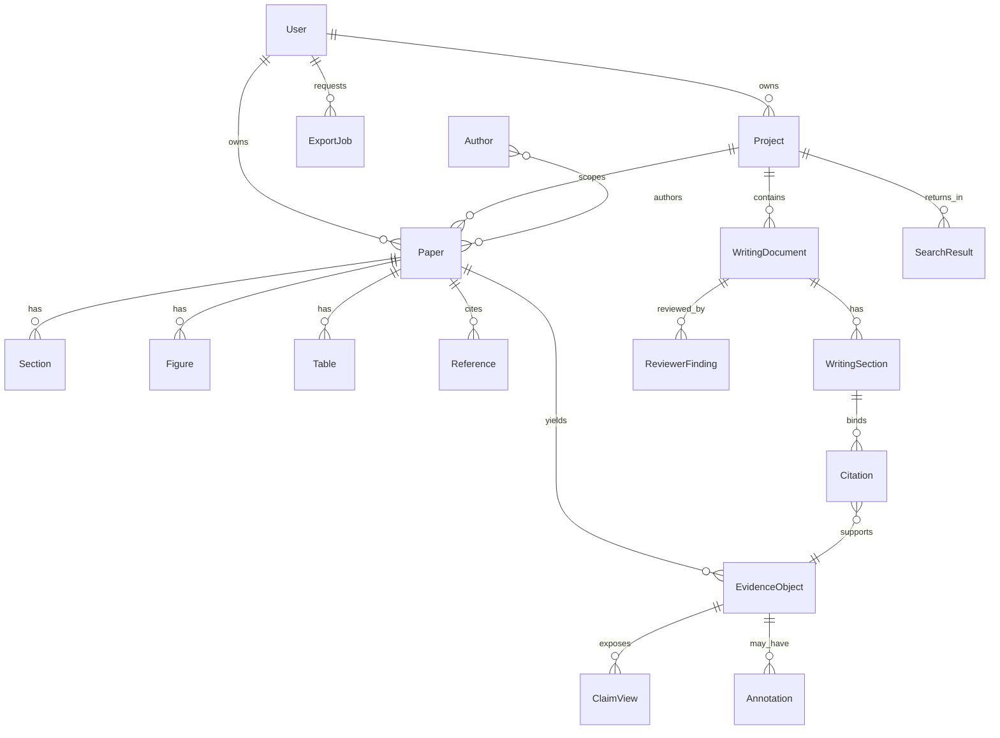

# IDD-0002 — Domain Model

| Field | Value |
|-------|-------|
| **Status** | Active (Evidence + ReviewerRun; A-405) |
| **Depends on** | [IDD-0001](./IDD-0001-System-Architecture.md) |
| **Consumers** | A (schema/APIs), B (types/UI models) |
| **DTO freeze** | [docs/contracts/evidence-contract.md](../contracts/evidence-contract.md) |

---

## 1. Domain glossary

| Term | Meaning |
|------|---------|
| **Paper** | A library item (PDF or metadata stub). Persisted as `files`. |
| **Evidence Object** | Canonical research knowledge unit extracted from a Paper. |
| **Claim** | Propositional content **within** an Evidence Object (not a separate root aggregate). |
| **Writing Document** | Manuscript under edit (`documents`). |
| **ReviewerRun** | Durable Research Reviewer execution (`reviewer_runs`); findings in `reviewer_findings`. ≠ claim_reviews. |
| **Research Ready** | Paper processing gate allowing Evidence extraction. |

---

## 2. Entity relationship overview

---

## 3. Core entities

### 3.1 User

| | |
|--|--|
| **Purpose** | Authenticated account; ownership root. |
| **Ownership** | Self. |
| **Lifecycle** | `invited` → `active` → `suspended` / `deleted` (soft). |

**Fields**

| Field | Type | Notes |
|-------|------|-------|
| `id` | int | PK |
| `email` | string | Unique, normalized lower |
| `name` | string | Display |
| `picture` | string \| null | Avatar URL |
| `plan` | enum | `free` \| `beta` \| `pro` (extensible) |
| `status` | enum | Account lifecycle |
| `is_admin` | bool | Ops |
| `session_version` | int | JWT invalidation |
| `created_at` | datetime | |

**Relationships:** owns Projects, Papers, WritingDocuments, ExportJobs.

---

### 3.2 Project

| | |
|--|--|
| **Purpose** | Research workspace boundary for Library subset, Evidence, Writing. |
| **Ownership** | `user_id` |
| **Lifecycle** | `active` → `archived` |

**Fields:** `id`, `user_id`, `name`, `emoji?`, `instructions?` (research brief), `created_at`, `updated_at`

**Relationships:** many Papers (via `project_id` on Paper), EvidenceObjects, WritingDocuments, ProjectQuestions (extension).

---

### 3.3 Library

| | |
|--|--|
| **Purpose** | Logical collection of Papers for a user (optionally project-filtered). Not a separate table—**query view** over Papers + Collections. |
| **Ownership** | User |
| **Lifecycle** | N/A (derived) |

**Fields (view):** `paper_count`, `research_ready_count`, `collections[]`, `connection_status` (Zotero/Mendeley)

**Relationships:** contains Papers; may include `LibraryCollection` entities (backend tables already exist).

---

### 3.4 Paper

| | |
|--|--|
| **Purpose** | Citable research document in the Library. **Maps to `files`.** |
| **Ownership** | `user_id`; optional `project_id` |
| **Lifecycle** | `uploaded` → `processing` → `research_ready` \| `failed` → `archived` |

**Fields**

| Field | Type | Notes |
|-------|------|-------|
| `id` | int | PK |
| `user_id` | int | |
| `project_id` | int \| null | |
| `title` | string \| null | |
| `name` | string | Original filename |
| `authors` | string[] \| string | Serialized consistently in API as `AuthorRef[]` preferred |
| `year` | int \| null | |
| `venue` | string \| null | |
| `doi` | string \| null | |
| `pmid` | string \| null | Optional |
| `research_readiness` | enum | See constants |
| `research_readiness_label` | string \| null | |
| `import_source` | enum | `upload` \| `zotero` \| `mendeley` \| `discover` \| … |
| `source_url` | string \| null | |
| `meta_status` | string | Pipeline meta |
| `storage_key` | string \| null | Object storage |
| `created_at` | datetime | |

**Relationships:** Sections, Figures, Tables, References, EvidenceObjects, Chunks (internal).

---

### 3.5 Author

| | |
|--|--|
| **Purpose** | Attribution for a Paper. |
| **Ownership** | Derived from Paper metadata (may be normalized later). |
| **Lifecycle** | Tied to Paper metadata revisions. |

**Fields:** `name` (required), `orcid?`, `affiliation?`  
**API shape:** `AuthorRef { name, orcid?, affiliation? }`  
**Note:** Phase 1 may serialize authors as strings; Frontend should accept both until normalized.

---

### 3.6 Section

| | |
|--|--|
| **Purpose** | Structural unit of a Paper (Abstract, Methods, …) from Document Understanding. |
| **Ownership** | Paper |
| **Lifecycle** | Created/updated by analysis pipeline versions. |

**Fields:** `id`, `paper_id`, `heading`, `order_index`, `section_type?`, `page_start?`, `page_end?`, `text_preview?`

---

### 3.7 Figure

| | |
|--|--|
| **Purpose** | Detected figure reference/caption in a Paper. |
| **Ownership** | Paper |
| **Lifecycle** | Pipeline-produced; immutable per `pipeline_version`. |

**Fields:** `id`, `paper_id`, `label` (e.g. “Figure 2”), `caption?`, `page?`, `storage_key?`

---

### 3.8 Table

| | |
|--|--|
| **Purpose** | Detected table reference/caption. |
| **Ownership** | Paper |
| **Lifecycle** | Same as Figure. |

**Fields:** `id`, `paper_id`, `label`, `caption?`, `page?`

---

### 3.9 Reference

| | |
|--|--|
| **Purpose** | Bibliographic item cited by a Paper (bibliography entry). |
| **Ownership** | Paper |
| **Lifecycle** | Pipeline / import. |

**Fields:** `id`, `paper_id`, `raw_text?`, `title?`, `doi?`, `year?`, `authors?`

**Distinct from Citation** (Writing → Evidence binding).

---

### 3.10 Citation

| | |
|--|--|
| **Purpose** | Link from Writing content to an Evidence Object (and optionally Paper). |
| **Ownership** | WritingDocument / user |
| **Lifecycle** | Created on grounded insert/bind; deleted with unbind. |

**Fields:** `id`, `document_id`, `evidence_object_id`, `block_id?`, `sentence_span?`, `citation_style?`, `created_at`

**Persisted as** `writing_sentence_bindings` (+ client citation list on grounded responses).

---

### 3.11 EvidenceObject

| | |
|--|--|
| **Purpose** | **Canonical** research knowledge unit. All RI/Writing/Reviewer features consume this. |
| **Ownership** | `user_id` + `project_id`; sourced from `paper_id` (`file_id`) |
| **Lifecycle** | `candidate` → `accepted` \| `rejected` \| `superseded` |

**Fields (contract)**

| Field | Type | Notes |
|-------|------|-------|
| `id` | int | |
| `project_id` | int | Required |
| `paper_id` | int | API alias of `file_id` |
| `file_id` | int | Persistence name (both may appear; `paper_id` preferred in new clients) |
| `quote` | string \| null | Anchored excerpt |
| `claim` | string \| null | Proposition |
| `finding` | string \| null | Optional structured finding |
| `evidence_type` | enum | See constants |
| `confidence_band` | `low` \| `moderate` \| `high` | |
| `status` | enum | Lifecycle |
| `page_start` / `page_end` | int \| null | Anchors |
| `supports` / `contradicts` / `limitations` | object/array | JSON |
| `pipeline_version` | string | |
| `content_hash` | string | Dedup |
| `supersedes_id` | int \| null | |
| `provenance` | object | Extraction metadata |
| `created_at` / `updated_at` | datetime | |

**Relationships:** ClaimView (virtual), Annotations, Citations, ClaimReviews (human evidence review).

---

### 3.12 Claim

| | |
|--|--|
| **Purpose** | Logical proposition under study. **Not a root table.** |
| **Ownership** | Via EvidenceObject |
| **Lifecycle** | Same as parent EvidenceObject |

**Fields (view):** `text` ← `EvidenceObject.claim`, `evidence_object_id`, `confidence_band`, `status`  
**Rule:** Do not introduce `claims` table without ADR reversing ADR-0003.

---

### 3.13 Annotation

| | |
|--|--|
| **Purpose** | User or system note on a Paper span or Evidence Object. |
| **Ownership** | User |
| **Lifecycle** | `active` → `deleted` |

**Fields:** `id`, `user_id`, `paper_id?`, `evidence_object_id?`, `body`, `anchor?`, `created_at`  
**Note:** May map to existing Notes feature initially (`notes` table) with `kind=annotation`.

---

### 3.14 WritingDocument

| | |
|--|--|
| **Purpose** | Manuscript container. |
| **Ownership** | `user_id` + `project_id` |
| **Lifecycle** | `draft` → `in_review` → `exported` → `deleted` (soft) |

**Fields:** `id`, `project_id`, `user_id`, `title`, `body` (or sectioned), `status`, `last_autosave_key?`, `created_at`, `updated_at`

---

### 3.15 WritingSection

| | |
|--|--|
| **Purpose** | Logical section inside a WritingDocument (Introduction, Lit Review, …). |
| **Ownership** | WritingDocument |
| **Lifecycle** | Edited with document versions |

**Fields:** `id` (client or server), `document_id`, `section_type` (enum), `title?`, `content_markdown`, `order_index`

**section_type values:** see Shared Constants (aligned with EvidenceQuery).

---

### 3.16 ReviewerFinding

| | |
|--|--|
| **Purpose** | Automated Research Reviewer issue on a draft. |
| **Ownership** | WritingDocument |
| **Lifecycle** | Produced per review run; superseded by newer `reviewer_version` run |

**Fields:** `id?`, `document_id`, `code`, `severity`, `message`, `section_id?`, `evidence_ids?`, `reviewer_version`, `created_at`

**Distinct from** human Evidence reviews (`claim_reviews`).

---

### 3.17 SearchResult

| | |
|--|--|
| **Purpose** | Polymorphic hit from Library / Evidence / Project / Discover search. |
| **Ownership** | Ephemeral response DTO |
| **Lifecycle** | Request-scoped |

**Fields:** `kind` (`paper` \| `evidence` \| `note` \| `citation` \| `chat` \| `project`), `ref_id`, `title`, `snippet?`, `score?`, `project_id?`, `paper_id?`, `evidence_object_id?`

---

### 3.18 ExportJob

| | |
|--|--|
| **Purpose** | Async or sync packaging of a WritingDocument (+ bibliography). |
| **Ownership** | User |
| **Lifecycle** | `pending` → `running` → `done` \| `failed` |

**Fields:** `id`, `user_id`, `document_id`, `format` (`markdown` \| `docx` \| `bibtex` \| …), `status`, `download_url?`, `error?`, `created_at`, `completed_at?`

---

## 4. Shared constants (normative)

### 4.1 Research readiness

`uploaded` | `processing` | `research_ready` | `failed` | `archived`

### 4.2 Evidence status

`candidate` | `accepted` | `rejected` | `superseded`

### 4.3 Confidence bands

`low` | `moderate` | `high`

### 4.4 Evidence types (extensible)

`method` | `dataset` | `metric` | `finding` | `limitation` | `definition` | `other`

### 4.5 EvidenceQuery intents

`support_sentence` | `answer_question` | `review_coverage` | `compare_topic` | `list_project`

### 4.6 Writing section types

`support_sentence` | `introduction` | `literature_review` | `discussion` | `clinical_summary` | `research_gap` | `executive_summary`

### 4.7 Reviewer severities

`info` | `warning` | `error`

### 4.8 Citation styles (export)

`apa` | `mla` | `chicago` | `ieee` | `vancouver` | `bibtex`

### 4.9 Study types (Document Understanding; optional on Paper)

`rct` | `observational` | `review` | `meta_analysis` | `qualitative` | `methods` | `other`

### 4.10 Job statuses

`pending` | `running` | `done` | `failed`

---

## 5. Ownership matrix

| Entity | Owner key | Project scoped? |
|--------|-----------|-----------------|
| Project | `user_id` | — |
| Paper | `user_id` | optional |
| EvidenceObject | `user_id` | **required** |
| WritingDocument | `user_id` | **required** |
| ExportJob | `user_id` | via document |
| Annotation | `user_id` | optional |

Unauthorized cross-user access → `403` (IDD-0007).
