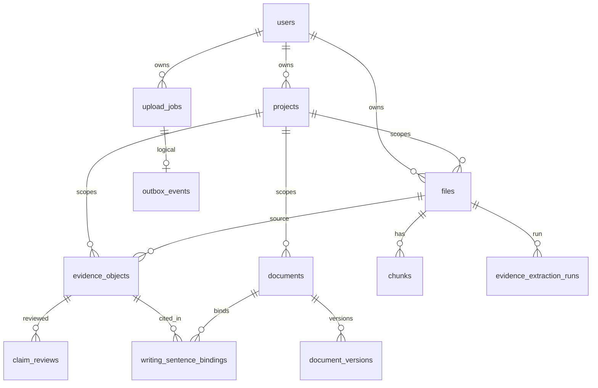

# IDD-0005 — Database Schema Contracts

| Field | Value |
|-------|-------|
| **Status** | Proposed |
| **ORM** | SQLAlchemy 2.x + raw SQL migrations (`migrations/NNNN_*.sql`) |
| **Not used** | Prisma, Drizzle |

This is a **contract-level** schema: names, keys, relationships, indexes. Exact column types follow existing migrations; new columns need a migration file + IDD bump.

---

## 1. Principles

1. Core identity tables (`users`, `projects`, `files`, `conversations`) are created by application metadata bootstrap; numbered migrations assume they exist.
2. Cross-module FKs to `server.Base` tables may be declared in SQL migrations; ORM may use Integer soft FKs across private Bases.
3. Structured payloads stored as **Text JSON** (app-serialized), not as a requirement for DB JSONB (JSONB allowed where migrations already use it).
4. **Paper** ≡ `files`. **EvidenceObject** ≡ `evidence_objects`. **WritingDocument** ≡ `documents`.

---

## 2. Entity → table map

| Domain entity | Table |
|---------------|-------|
| User | `users` |
| Project | `projects` |
| Paper | `files` |
| EvidenceObject | `evidence_objects` |
| Evidence review | `claim_reviews` |
| Citation binding | `writing_sentence_bindings` |
| Extraction run | `evidence_extraction_runs` |
| WritingDocument | `documents` |
| Document version | `document_versions` |
| Document activity | `document_activity` |
| Upload / jobs | `upload_jobs`, `upload_batches`, `outbox_events` |
| Chunks (RAG) | `chunks` |
| Library OAuth | `library_connections`, `library_sync_runs` |
| Collections | `library_collections`, `library_collection_papers` |
| Analysis | `analysis_pipeline_results`, `paper_analyses` |
| Section/Figure/Table/Reference | Prefer structured payloads in analysis results **or** future child tables—do not block UI on missing normalized tables |

---

## 3. Core relational diagram

---

## 4. Keys, constraints, cascades

### 4.1 `users`

- PK: `id`
- Unique: `email`
- Notes: `session_version` increments invalidate JWTs

### 4.2 `projects`

- PK: `id`
- FK: `user_id → users.id` ON DELETE CASCADE (preferred)
- Index: `(user_id)`

### 4.3 `files` (Paper)

- PK: `id`
- FK: `user_id → users.id`
- FK: `project_id → projects.id` NULL ON DELETE SET NULL
- Indexes: `(user_id, created_at DESC)`, library search indexes (doi, title, import_source—per migrations 0028+)
- Soft constraints: DOI uniqueness per user is application-level (dedupe on import)

### 4.4 `evidence_objects`

- PK: `id`
- Logical FKs: `user_id`, `project_id`, `file_id`, `supersedes_id`
- **Active uniqueness (SQL):** `(project_id, file_id, content_hash, pipeline_version)` WHERE status NOT IN (`superseded`, `rejected`) — as per migration 0033 intent
- Indexes: `(project_id, status)`, `(file_id)`, `(project_id, confidence_band)`
- Cascade: deleting Project should prevent orphan evidence (app delete or ON DELETE CASCADE in migration)—**Backend must document chosen policy**; Frontend must not assume silent cascade without API.

### 4.5 `claim_reviews`

- PK: `id`
- FK: `evidence_object_id → evidence_objects.id` ON DELETE CASCADE
- Stores human accept/reject/edit audit

### 4.6 `writing_sentence_bindings`

- PK: `id`
- FKs: `document_id`, `evidence_object_id`, `user_id`, `project_id`
- Unique optional: `(document_id, evidence_object_id, block_id)` when block_id present
- ON DELETE CASCADE from document

### 4.7 `documents` (WritingDocument)

- PK: `id`
- FKs: `user_id`, `project_id`
- `last_autosave_key` for idempotent PATCH
- Index: `(project_id, updated_at DESC)`

### 4.8 `document_versions` / `document_activity`

- Version history append-only
- Activity may store reviewer snapshots (Phase 2 extension)

### 4.9 `upload_jobs`

- PK: `id`
- Columns: `job_type`, `status`, `attempts`, `run_after`, `payload`/refs, timestamps
- Indexes: poll index `(status, run_after)` for `SKIP LOCKED`
- No hard FK required to outbox; correlation via aggregate id

### 4.10 `outbox_events`

- PK: `id`
- `aggregate_type`, `aggregate_id`, `status` (`pending`|`dispatched`)
- Index: undelivered poll

### 4.11 `chunks`

- PK: `id`
- FK: `file_id`
- `embedding` stored as JSON floats (current)—future pgvector via ADR

---

## 5. Recommended indexes (contract)

| Table | Index | Reason |
|-------|-------|--------|
| `evidence_objects` | `(project_id, status)` | Inspector lists |
| `evidence_objects` | `(file_id)` | Per-paper evidence |
| `files` | `(user_id, project_id)` | Library filters |
| `documents` | `(project_id, status)` | Writing list |
| `upload_jobs` | `(status, run_after)` | Worker |
| `writing_sentence_bindings` | `(document_id)` | Export |

---

## 6. Future tables (non-breaking)

| Table | When | Purpose |
|-------|------|---------|
| `reviewer_runs` | Phase 2 | Durable ReviewerResult |
| `export_jobs` | Phase 2–3 | If export becomes always async |
| `paper_sections` / `paper_figures` | Phase 3 | Normalize DU outputs |
| Normalized `authors` | Phase 3 | ORCID graph |

Adding these MUST NOT change EvidenceObject meaning.

---

## 7. Migration rules

1. One concern per `NNNN_name.sql`.
2. Prefer `IF NOT EXISTS` / `ADD COLUMN IF NOT EXISTS`.
3. Never rely on `create_all` for new columns on existing tables.
4. Document rollback notes in migration header comment.
5. Bootstrap order: ensure core tables exist → `run_migrations.py` → seed.
