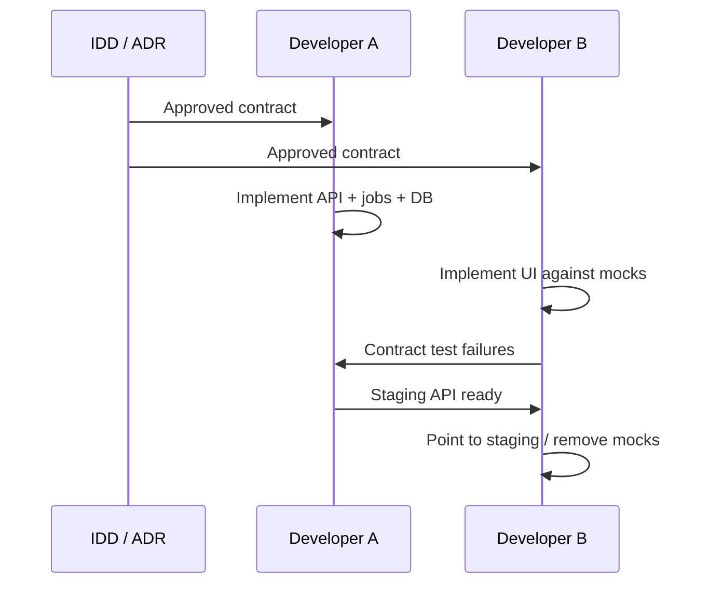

# IDD-0009 — Development Workflow

| Field | Value |
|-------|-------|
| **Status** | Proposed |
| **Teams** | Developer A (Backend/AI), Developer B (Frontend/Design) |

---

## 1. Contract-first collaboration

**Rule:** If implementation and IDD disagree, **IDD wins** until a revision is merged.

---

## 2. Parallel work split

| Developer A can ship alone | Developer B can ship alone |
|----------------------------|----------------------------|
| Migrations, workers, extractors | Figma → components |
| Evidence/RI/Writing services | Pages with MSW mocks |
| Auth, search backends | Design system, a11y |
| OpenAPI export from routes | TypeScript interfaces from IDD-0004 |
| Integration tests vs Postgres | Visual / Playwright against mocks |

**Sync points (scheduled):**

1. IDD approval  
2. First staging smoke of Paper → Extract → Write → Review → Export  
3. Pre-release contract diff review  

---

## 3. Mock API generation

1. Treat IDD-0003 as source; optionally generate OpenAPI YAML (`docs/idd/openapi-v1.yaml`—future artifact).
2. Frontend MSW handlers mirror routes + status codes.
3. Fixtures: happy, empty, blocked writing, 401, 429, job running/failed.
4. Backend provides `scripts/smoke_idd_contracts.py` (future) hitting staging.

---

## 4. Branching & merge

| Rule | Detail |
|------|--------|
| Base branch | `main` |
| Feature branches | `feat/a-…` (backend), `feat/b-…` (frontend), `idd/…` (contracts) |
| IDD changes | Merge before dependent feature PRs when breaking |
| PR size | Prefer vertical slices that honor contracts |
| Reviews | A reviews B API usage; B reviews A response shapes against TS interfaces |
| No `--force` on `main` | — |

---

## 5. Definition of Done (feature)

A feature is done only when:

1. **Contract:** Covered by IDD (or IDD updated in same PR).  
2. **API:** Matches request/response/errors; ownership enforced.  
3. **UI:** Loading, empty, error states implemented (IDD-0004).  
4. **Evidence rule:** No raw-PDF or free-prompt bypass for research claims.  
5. **Versions:** `pipeline_version` / `writing_version` / `reviewer_version` stamped where applicable.  
6. **Tests:** Backend unit/integration for contract breaks; Frontend tests or MSW scenarios for critical paths.  
7. **Docs:** Changelog note if deprecating.  
8. **Obs:** Failures log `error` code + aggregate ids (no secrets).

---

## 6. Communication protocol

| Need | Channel |
|------|---------|
| Ambiguous field | Issue linked to IDD section |
| Blocked on missing endpoint | B ships mock; A prioritizes by DoD smoke path |
| Hotfix breaking SPA | A dual-writes field; notify B |

---

## 7. Naming in repos

- Commits: `feat:`, `fix:`, `idd:`, `docs:`
- Avoid drive-by rewrites of `server.py` unrelated to the PR (constitution).

---

## 8. Local run expectations

| Role | Needs |
|------|-------|
| A | Postgres for worker/queue tests; Redis optional |
| B | Vite + mocked API **or** Flask `:5000` with seed data |
| Both | Document which mode in PR |

Marketing Jinja ≠ SPA; B does not own `/product` unless explicitly tasked.
