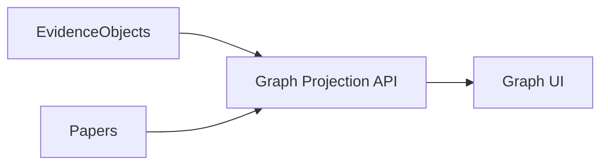

# IDD-0010 — Future Extension Points

| Field | Value |
|-------|-------|
| **Status** | Proposed |
| **Rule** | Extensions are **additive**. They consume Evidence Objects. They do not break v1 contracts. |

---

## 1. Extension doctrine

```text
New capability
  → EvidenceQuery intent and/or new read model
  → Optional new job_type in HANDLERS
  → Optional new table referencing evidence_objects / documents
  → Frontend page behind feature flag
```

**Forbidden without ADR:** parallel knowledge store, EvidenceQuery `prompt`/`model` fields, replacing Postgres queue.

---

## 2. Module extension map

### 2.1 Consensus Engine

| | |
|--|--|
| **Today** | `POST /api/evidence/consensus` |
| **Extend** | Richer aggregate DTO; UI compare chips |
| **Preserve** | Input remains EvidenceQuery → EvidenceObjects |

### 2.2 Conflict Engine

| | |
|--|--|
| **Today** | `POST /api/evidence/conflict` |
| **Extend** | Mediator codes catalog; paper-pair UI |
| **Preserve** | No silent resolution without user action |

### 2.3 Knowledge Graph

| | |
|--|--|
| **Today** | Per-document Phase 1.7 signals; paper graph tab |
| **Extend** | Project-level graph **projection** over EvidenceObjects + Papers |
| **Preserve** | Graph is a view—not a second SoT |



### 2.4 Research Assistant

| | |
|--|--|
| **Today** | Project research presets, demoted chat, ask-from-library |
| **Extend** | Assistant answers **must** cite EvidenceObject ids |
| **Preserve** | Chat never becomes Library replacement |

### 2.5 Compare Workspace

| | |
|--|--|
| **Today** | `/research/compare` APIs |
| **Extend** | Multi-paper evidence alignment using rank/consensus/conflict |
| **Preserve** | Same ownership rules |

### 2.6 Publication Engine / Journal Compliance

| | |
|--|--|
| **Today** | Markdown export + citation bindings |
| **Extend** | `ExportJob` formats: DOCX, LaTeX, journal checklists |
| **Preserve** | Export includes provenance (writing_version, evidence ids) |

### 2.7 Citation Intelligence

| | |
|--|--|
| **Extend** | Ranking strategies `citation_intel_v1`; style validation |
| **Preserve** | Strategies named + versioned on EvidenceQuery |

### 2.8 Trust Center (`/trust`)

| | |
|--|--|
| **Extend** | Marketing + API narrative: what AI may/may not do |
| **Preserve** | Matches runtime gates (Research Ready, accepted-only defaults) |

---

## 3. Adding a new EvidenceQuery intent

1. Append to IDD-0002 constants (do not reuse meanings).  
2. Implement server allowlist.  
3. Add Frontend type union.  
4. Document stage behavior (retrieve-only vs full writing).  
5. Feature-flag UI.

---

## 4. Adding a new job_type

1. Name `snake_case`.  
2. Register in worker `HANDLERS`.  
3. Emit events from IDD-0006 catalog or add new event with envelope.  
4. Frontend polls `JobStatus`.  
5. Migration only if new tables required.

---

## 5. Feature flags

Use existing `feature_flags` (or equivalent) for:

- `evidence_writing_v2`
- `project_knowledge_graph`
- `export_docx`
- `research_assistant_citations_required`

Flags default off in production until contract tests pass.

---

## 6. Long-term scalability (non-binding options)

| Option | Trigger | Requirement |
|--------|---------|-------------|
| pgvector / ANN | Chunk corpus latency SLO miss | New ADR |
| Split Evidence service | Team/org scale | ADR; keep HTTP contracts |
| Webhook event bus | External integrations | Same event envelope |
| Teams / shared projects | Product demand | New AuthZ model in IDD-0007 revision |

---

## 7. Explicit non-goals (still)

- “Prompt → thesis” product path  
- Fake KG without EvidenceObjects  
- Celery migration without ADR-0001 replacement  
- Claim root table competing with EvidenceObject  

---

## 8. Approval checklist for extensions

- [ ] Consumes Evidence Objects (or Document Understanding only for structure)  
- [ ] No forbidden EvidenceQuery keys  
- [ ] Additive API / TS types updated  
- [ ] Ownership tests  
- [ ] Frontend empty/loading/error states  
- [ ] Version stamp present  
- [ ] IDD section updated in same PR if contract changes  
