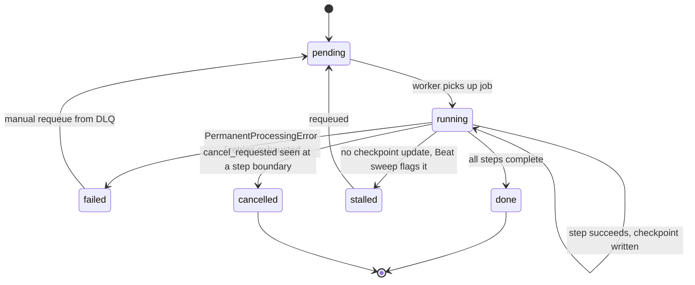

# Everything After Upload — Processing Pipeline Architecture

Scope: what happens once a file is confirmed and stored — the multi-step
pipeline (extract → chunk → embed → metadata → analysis, plus
compare/gap-finder) that today runs as fire-and-forget
`threading.Thread(daemon=True)` calls. Design only, matching the format of
[`upload-architecture.md`](./upload-architecture.md) and
[`database-design.md`](./database-design.md) — implementation is a
follow-up phase, the same way `docs/database-design.md` preceded the
actual storage-package build.

## 0. This supersedes one earlier call — on purpose

`upload-architecture.md` §2 explicitly said *"do not add Redis, Celery, or
a message broker"* and proposed a Postgres `SKIP LOCKED` table instead.
That was the right call **for a plain job queue** (enqueue, run once,
retry a few times). It stops being the right call once the actual
requirement list includes **priority queues, cooperative cancellation,
worker heartbeats, and a dead-letter workflow** — all four of those are
exactly Celery's core, battle-tested feature set. Hand-building all four
on top of `SKIP LOCKED` polling would mean re-implementing most of Celery
from scratch, worse and untested. At that point, adopting Celery is the
*less* code, not more.

This doesn't strand the earlier decision, either: `database-design.md` §5
already put Redis in the architecture (rate limiting, locks, status
cache). Celery just becomes a second, heavier user of a broker that was
already going to exist — not a new piece of infrastructure.

`UploadJob` (from `database-design.md`) doesn't get thrown away — it
becomes the **durable state** Celery tasks read and write, while Celery
itself only owns scheduling, retry, and worker orchestration. This split
matters (see §1): Celery's own result backend is deliberately *not* used,
because Postgres already durably holds the result.

---

## 1. Celery architecture

```
celery_app.py         # Celery() factory: broker/backend config, queue
                       # routing, beat schedule
tasks/
  import_file.py       # extract → chunk → embed  (Step Runner, §9)
  extract_metadata.py
  paper_analysis.py
  memory_extraction.py
  compare.py
  gap_finder.py
  maintenance.py        # gc_storage, reconcile_storage, sweep_temp,
                         # stalled-job sweep (§7) — Beat-scheduled
```

- **Broker**: Redis — the same instance `database-design.md` §5 already
  specifies for rate limiting/locks/cache, different key prefix
  (`celery-broker` DB index), not a second service.
- **Result backend: disabled** (`task_ignore_result=True` globally).
  `UploadJob`'s `status`/`checkpoint` columns are the durable result;
  Celery's result backend would be a second, redundant copy of the same
  fact that can drift from the first. A task's only side effect that
  matters is the row it writes.
- **Task signature convention**: every task takes `(job_id: int)`, not a
  bag of business parameters — it loads the `UploadJob` row itself, so
  the row (not the task call) is the single source of truth for what to
  do. This is also what makes a task safely re-runnable after a crash: a
  fresh worker picking it up needs nothing but the id.

---

## 2. Worker pools

One workload, two very different profiles — mixing them in one pool
either wastes CPU-bound headroom on I/O-bound waiting, or starves CPU work
behind a long OpenAI call. Split by profile, not by task name:

| Pool | Concurrency model | Handles | Why |
|---|---|---|---|
| `worker-import` | `prefork`, concurrency 2-4 | PDF/DOCX/PPTX/XLSX extraction, chunking | CPU-bound parsing (PyMuPDF, python-docx); prefork gives real process isolation if a malformed file wedges a worker |
| `worker-ai` | `gevent`, concurrency 20-50 greenlets | embeddings, metadata extraction, paper analysis, compare, gap-finder | Almost entirely spent waiting on the OpenAI API — greenlets let one process hold dozens of in-flight requests instead of one thread/process each |
| `worker-maintenance` | `prefork`, concurrency 1 | GC, reconciliation, temp sweep, stalled-job sweep | Low volume, periodic (Beat-scheduled), no concurrency benefit |

No autoscaling config beyond static `--concurrency` at this stage —
`--autoscale=max,min` is one flag to add later if queue depth actually
becomes a signal worth reacting to; building that reaction logic now,
before there's a queue-depth graph to look at, would be tuning a number
nobody has measured yet.

---

## 3. Distributed locking

Two lock primitives, for two different failure tolerances — reconciles
directly with `database-design.md` §5's Redis schema, which already
reserved `lock:{name}` for this:

- **Redis lock (`SET NX PX`, TTL-bound)** — for frequent, low-stakes
  mutual exclusion: at-most-once processing of a given job even though
  Celery + Redis broker gives *at-least-once* delivery (not exactly-once)
  by default. A crashed lock-holder auto-releases at the TTL instead of
  wedging forever, which a plain Postgres advisory lock does not do on
  its own.
- **Postgres advisory lock (`pg_advisory_lock`)** — for infrequent,
  must-not-silently-fail locks: the model-list cache refresh (today's
  `_model_lock`), or a one-time migration guard. Postgres is the more
  durable of the two stores; reserve it for the cases where "durable"
  matters more than "fast."

---

## 4. Queue priorities

Redis-backed Celery doesn't have RabbitMQ-style true message priority —
the practical implementation is **named queues, not a priority field**:

```
high    — interactive: user is looking at this file right now
                        ("refresh analysis" button, paper chat needing a
                        fresh embed)
default — normal upload processing: import, metadata extraction
low     — bulk/background: compare, gap-finder across many papers,
                            maintenance tasks
```

Route tasks to a queue at `.apply_async(queue=...)` time based on what
triggered them (a live user click → `high`; an upload's own pipeline →
`default`; a scheduled/bulk operation → `low`). **Dedicated workers per
queue** (not one worker consuming all three in priority order) so a
backlog in `low` can never delay `high` — head-of-line blocking is exactly
what separate worker pools avoid, and it costs nothing extra since §2
already splits workers by profile.

---

## 5. Checkpointing

Generalizes `database-design.md`'s `ImportSession.checkpoint` (JSONB) from
"import only" to every multi-step pipeline (formalized as the Step Runner,
§9). A checkpoint is the minimum state needed so a retried task resumes
instead of redoing finished work:

```json
{"stage": "embed", "embedded_count": 40, "total_pieces": 100}
```

Written at natural batch boundaries — `embed_texts()` already batches 64
texts per OpenAI call, so checkpointing once per batch is free
granularity, not an added round-trip. Checkpointing every single item
would be finer-grained but pay for a DB write per item; checkpointing only
at pipeline-stage boundaries (extract *done*, chunk *done*, embed *done*)
would mean a crash mid-embed re-embeds and re-bills for everything already
embedded. Per-batch is the point that matches an existing boundary in the
code rather than inventing a new one.

---

## 6. Retry engine

Celery's built-in retry, not a hand-rolled backoff loop:

```python
@app.task(bind=True, autoretry_for=(TransientProcessingError,),
          retry_backoff=True, retry_backoff_max=600, retry_jitter=True,
          max_retries=5)
def run_import(self, job_id): ...
```

The one piece of real design work is the exception split, because
**not every failure should retry**:

- `TransientProcessingError` — OpenAI rate limit/5xx, network blip,
  storage timeout. Retry with backoff.
- `PermanentProcessingError` — corrupt/unsupported file, a prompt that
  will deterministically fail the same way every time. Retrying five
  times just delays the inevitable and burns five retries' worth of
  backoff for nothing — straight to the dead-letter queue instead (§7).

`autoretry_for` is scoped to the transient type only, so a permanent
failure surfaces immediately rather than after `max_retries` of pointless
waiting.

---

## 7. Dead-letter queue

Celery has no built-in DLQ concept (unlike SQS/RabbitMQ) — and doesn't
need a new table to get one. `UploadJob.status = 'failed'` (already in
`database-design.md`) **is** the dead-letter queue:

```sql
SELECT * FROM upload_jobs WHERE status = 'failed' ORDER BY updated_at DESC;
```

`on_failure`/`after_return` handlers write `last_error` and set
`status='failed'` whenever retries are exhausted or a
`PermanentProcessingError` is raised. A small admin action —
`status='pending', attempts=0` + re-enqueue — is the "requeue from DLQ"
operation, for a human to trigger once the underlying cause (bad prompt,
OpenAI outage, since-fixed parser bug) is actually fixed. No separate
queue, no separate table: the same `status` column the architecture doc
already designed carries this.

---

## 8. Cancellation

`task.revoke(task_id, terminate=True)` exists in Celery but is a blunt
instrument — `SIGTERM`/`SIGKILL` on a prefork worker mid-DB-write can
leave a row half-updated. Prefer **cooperative cancellation**: the Step
Runner (§9) checks a `cancel_requested` flag on the `UploadJob` row
between steps (and between embedding batches, reusing the same checkpoint
boundary from §5) and exits cleanly, marking `status='cancelled'`, if set.

```
POST /api/uploads/jobs/<id>/cancel   → sets cancel_requested = true
```

Hard `revoke(terminate=True)` stays available as the last resort for a
task that's genuinely wedged (infinite loop, hung C extension) and isn't
reaching its own checkpoint checks — not the first tool reached for.

---

## 9. Heartbeats — two different things, don't conflate them

1. **Worker liveness** — "is `worker-ai` process 3 still alive." Celery
   already does this (`celery inspect ping`, worker heartbeat events over
   the broker). Consumed via Flower or `celery events`, not reimplemented.
2. **Per-task progress** — "is job 482 still making progress, or stuck."
   This is the same signal as the checkpoint write in §5: every checkpoint
   bumps `UploadJob.updated_at`. No separate heartbeat mechanism —
   the checkpoint *is* the heartbeat. A Beat-scheduled sweep flags any job
   with `status='running'` whose `updated_at` hasn't moved in N minutes as
   **stalled** (worker crashed without a chance to mark it failed) and
   requeues it.

---

## 10. Step Runner

The abstraction that ties §5–9 together: a pipeline is an ordered list of
named steps, not one monolithic function, so retry/checkpoint/cancel/
heartbeat all have one place to hook into instead of four bespoke
mechanisms per pipeline.

```
Step:
    name: str
    run(ctx) -> StepResult(output, checkpoint: dict)

StepRunner.execute(job, steps: list[Step]):
    resume_from = job.checkpoint.get("stage")
    for step in steps_from(steps, resume_from):
        if job.cancel_requested:
            job.mark_cancelled(); return
        try:
            result = step.run(ctx)
        except TransientProcessingError:
            raise                       # Celery autoretry resumes at
                                        # this exact step next attempt,
                                        # not the whole pipeline
        except PermanentProcessingError as e:
            job.mark_failed(e); return  # → dead-letter (§7)
        job.checkpoint = {"stage": step.name, **result.checkpoint}
        job.touch()                     # heartbeat (§9)
    job.mark_done()
```

The import pipeline becomes `steps=[Extract(), Chunk(), Embed()]`; compare
and gap-finder get their own step lists. Each `job_type` from
`database-design.md`'s `upload_jobs` table maps to one step list.



---

## 11. Pipeline versioning

`database-design.md` §2.8 already defined `pipeline_versions` as a JSONB
snapshot (`chunking_params`, `embed_model_version_id`,
`utility_model_version_id`, `prompt_versions`). The Step Runner adds one
more thing worth pinning: **the step list itself**. "v3 added a
dedup-check step before embed" is a pipeline change exactly like a prompt
edit is — extend the existing row with:

```sql
ALTER TABLE pipeline_versions ADD COLUMN steps jsonb NOT NULL DEFAULT '[]';
-- e.g. ["extract", "dedup_check", "chunk", "embed"]
```

so re-running an old `UploadJob` under its original `pipeline_version_id`
reconstructs the exact step sequence it ran under, not just the model and
prompt it used. `UploadJob.pipeline_version_id` (already in the schema)
is what a stalled/failed/retried job resumes under — it's fixed at
enqueue time, so a mid-flight prompt or step-list change never mutates a
job that's already running.

---

## 12. What this changes in `requirements.txt` and deployment

Net-new: `celery`, `redis` (client). Redis itself as a service was already
implied by `database-design.md` §5 — this is Celery becoming its second
consumer, not a new box to provision. Deployment gains three
long-running worker processes (`worker-import`, `worker-ai`,
`worker-maintenance`) plus one Beat scheduler process, replacing the four
`threading.Thread(daemon=True)` call sites in `server.py` one-for-one.

Not part of this doc: the actual implementation. Same shape as before —
`database-design.md` was the schema design, then a separate "implement
storage architecture" pass built it. Say the word for the equivalent pass
here.
