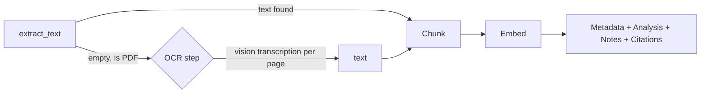

# Research Intelligence — Architecture

Scope: the content/AI layer — what actually happens *inside* each Step the
[Step Runner](./processing-pipeline-architecture.md) executes. Where that
doc designed the machinery that runs a step reliably (retry, checkpoint,
cancellation), this doc designs what each step *does*, and closes the
loop on [`database-design.md`](./database-design.md)'s Prompt/Model
Registry by showing each feature actually using them. Design only, same
format as the rest of this series.

Grounded in what's actually in `server.py` today — most of these 12
deliverables aren't greenfield. Four already work as described; the real
work is one genuine gap (OCR), three new features, and one correctness fix
(the cache key) that the rest of this doc leans on.

---

## 1. Intelligence Step catalog

| Step | Status today | Prompt registry entry | Model registry entry |
|---|---|---|---|
| Metadata extraction | **Exists** — `_extract_meta_from_text`, title/authors/year/venue/doi/abstract/keywords | `extract_metadata` | `utility_model` |
| OCR | **Gap** — scanned PDFs get a live vision fallback, never indexed (§2) | `ocr_transcribe` (new) | `vision_model` (new logical name) |
| Chunking | **Exists** — `chunk_text` / `chunk_document`, locator-aware | *(no prompt — deterministic)* | — |
| Embeddings | **Exists** — `embed_texts`, batched | *(no prompt)* | `embed_model` |
| Paper Analysis | **Exists** — `_run_paper_analysis`, 14 fields | `paper_analysis` | `utility_model` |
| Auto Notes | **New** (§3) — reuses Paper Analysis output, no new AI call | *(templating only, no prompt)* | — |
| Citation Extraction | **Exists but manual** — `citation_from_paper`, deterministic field copy | *(no prompt — deterministic)* | — |
| Reading Summary | **New** (§4) — reuses existing data, no new AI call | *(templating only, no prompt)* | — |
| Research Insights | **New** (§5) — library-wide, unlike existing manual compare/gaps | `research_insights` (new) | `utility_model` |
| Cache | **Exists but wrong key** (§6) — `content_hash` only, ignores prompt/model changes | — | — |
| Prompt Registry integration | See §7 | — | — |
| Model Registry integration | See §7 | — | — |

Every row with a prompt/model registry entry is a `Step` (per the Step
Runner) that resolves both at run time instead of reading a module-level
constant — the mechanics are identical across all of them, covered once
in §7 rather than repeated five times.

---

## 2. OCR — the one deliverable that's a genuine gap

**What happens today**: a scanned PDF (no text layer) makes
`extract_text()` return `""`. The upload route's `note = "scanned_pdf"`
branch fires, and `pdf_page_images()` rasterizes the first 6 pages to PNG
data-URLs so a vision-capable model can look at them **live, in chat**.

That's a real, useful fallback for "what does this figure show" — but it
means a scanned PDF **never gets a Chunk row**. Every downstream feature
in §1 that guards on `text and not is_note and n_chunks > 0` — metadata
extraction, Paper Analysis, Auto Notes, Citation Extraction, RAG retrieval
— silently never runs for it. Every chat turn also re-sends the same page
images instead of paying once and reusing text forever.

**Design**: add an OCR step between "extract returned nothing" and "give
up" — reusing exactly the two things that already exist, not adding a new
dependency:

1. `pdf_page_images()` — already renders the pages.
2. The existing OpenAI client, already configured for vision — call it
   once per page with a transcription prompt ("transcribe this page's
   text verbatim, preserve reading order, no commentary"), store the
   returned text as that page's content.
3. Feed the OCR'd text through the **exact same** `chunk_document` →
   `embed_texts` → metadata → analysis pipeline as any other PDF. From
   the pipeline's point of view, OCR just fills in the `text` that
   `extract_text()` would otherwise have returned — everything downstream
   is unchanged.

Deliberately *not* Tesseract/pytesseract or a dedicated cloud OCR API: both
would add a new dependency, and Tesseract specifically needs a system
binary installed on the host (real friction on Render/Railway/Fly, the
README's own deploy targets). The vision model is already paid-for,
already wired, and already good enough at transcription for typical
scanned academic papers.

**Ceiling, stated plainly**: per-page vision-model OCR costs one model
call per page and won't be as fast or as cheap per-page as a dedicated
OCR engine at high volume. If scanned-PDF volume ever justifies it,
swapping in Tesseract/a cloud OCR API behind the same "fill in `text`"
seam is a contained change — not a pipeline redesign.



---

## 3. Auto Notes

Manual notes already exist (`Note` model, `/api/notes` CRUD) — a user
writes their own. "Auto Notes" is new, but it should cost **zero
additional AI calls**: Paper Analysis already computes
`executive_summary`, `key_contributions`, `limitations`, `future_work`
for every paper. Auto Notes is a templating step over that existing JSON,
not a new prompt:

```
## {title}
**Summary**: {executive_summary}

**Key contributions**
{key_contributions as bullets}

**Limitations**
{limitations as bullets}
```

**Recommendation: generate a draft, don't silently create a row.** A
"Generate note from analysis" action pre-fills the existing note-creation
form with this template; the user reviews and saves (or discards) it —
same as any other note. Silently populating someone's Notes list without
them asking is the kind of unrequested-content surprise worth avoiding;
the auto-generation is in the *content*, not in bypassing the save step.
(Fully-automatic silent creation is a one-line change later if that
default turns out to be wanted — noted, not built speculatively.)

---

## 4. Reading Summary

Also zero new AI calls. Two shapes, both templated from data that already
exists (`reading_status`, `PaperAnalysis.executive_summary`, tags):

- **Dashboard widget**: "Continue reading" — papers with
  `reading_status='reading'`, each with its one-line
  `executive_summary` already on hand.
- **Periodic digest**: a weekly "what you read this week" email —
  `EmailService` already exists (`email_service.send`) and is
  provider-agnostic; this is a Beat-scheduled task (per the pipeline doc's
  `worker-maintenance` pool) that queries papers with
  `reading_status='read'` updated in the last 7 days and renders the same
  template as the dashboard widget into an email body.

Nothing here calls the model — it's a reporting view over data every
other step already produced.

---

## 5. Research Insights

Not the same thing as the existing `compare`/`gap_finder` features
(`/api/analysis/compare`, `/api/analysis/gaps`) — those are manual,
user-selected, bounded to 2-10 files, and already ship a
`research_trends` field. Research Insights is **library- or
project-wide**, unscoped, and runs on a schedule rather than a button
click — "you have 12 papers on transformer architectures, none newer than
2023" is a different question than "compare these 4 papers I picked."

**Design**: reuse the existing `DerivedAnalysis` table shape (it already
generalizes over a `kind` column: `compare` | `gaps`) — add `kind =
'insights'`, keyed by `(user_id, project_id)` instead of a manual file
selection hash. A Beat-scheduled task (weekly, or triggered when N new
papers land in a project) gathers every paper's existing metadata +
Paper Analysis summary in scope, and asks the model for trends/gaps/
clusters across the whole set — same `responses_text` call shape as
`_run_comparison`/`_run_gap_finder`, same JSON-normalization pattern,
new prompt (`research_insights`) because the question being asked is
different, not because the mechanism is.

---

## 6. Cache — the correctness fix underneath everything above

Today's idempotency check (`PaperAnalysis.content_hash == content_hash and
status == 'done'`) only accounts for the **input** changing. It does not
account for the **pipeline** changing — ship a better `paper_analysis`
prompt and every existing cached analysis stays stale forever, silently,
because nothing ever invalidates it. `upload-architecture.md` §8 flagged
this exact gap; this is where it gets fixed.

**Fix**: the cache key is `(content_hash, pipeline_version_id)`, not
`content_hash` alone — using `pipeline_version_id` from
`database-design.md` §2.8, which already snapshots the model + prompt
versions a job ran under:

```python
def is_cached(row, content_hash, pipeline_version_id):
    return (row.content_hash == content_hash
            and row.pipeline_version_id == pipeline_version_id
            and row.status == "done")
```

No new cache table or new infrastructure — `PaperAnalysis` and
`DerivedAnalysis` **are** the cache, this only changes the key they're
looked up by. Shipping prompt version 4 of `paper_analysis` then
correctly invalidates every row still pinned to version 3, without
anyone needing to remember to bump `content_hash` for a document that
didn't actually change.

A short-lived Redis layer (`database-design.md` §5's
`job:{id}:status` pattern) stays useful for one thing this doesn't
replace: caching the *status polling read itself* so the frontend's
`refetchInterval` doesn't hit Postgres every few seconds per open tab —
different problem (read latency) from this section (correctness of what
gets reused vs. regenerated).

---

## 7. Prompt Registry / Model Registry integration

Mechanically identical for every Step in §1 that has a prompt — shown
once:

```python
def run_metadata_extraction(job):
    prompt_version = prompt_registry.active("extract_metadata")
    model_version  = model_registry.active("utility_model")
    raw = responses_text(
        prompt_version.template.format(excerpt=job.text[:3000]),
        model=model_version.provider_model_id,
        json_mode=True,
    )
    ...
    job.prompt_version_id = prompt_version.id
    job.model_version_id  = model_version.id
```

Three things this replaces, all named in the earlier docs:

1. **`_META_PROMPT` / `_ANALYSIS_PROMPT` module constants** →
   `prompt_registry.active(name)` — the registry from `database-design.md`
   §2.6, seeded (per that doc's backfill plan) with today's literal
   prompt text as version 1.
2. **`UTILITY_MODEL` env var read directly** → `model_registry.active(
   "utility_model")` — §2.7, seeded from today's env vars as version 1.
   OCR introduces one new logical name, `vision_model` (today implicitly
   whatever the user's selected chat model is — the registry makes that
   an explicit, independently-versionable choice instead of inheriting
   whatever the chat UI happens to have selected).
3. **Every AI-generating row stores which version of each it ran
   under** (`prompt_version_id`, `model_version_id`) — which is exactly
   what §6's fixed cache key needs, and what
   `processing-pipeline-architecture.md` §11 needs to reconstruct a job's
   exact step sequence on retry.

Nothing here is a new mechanism — it's every existing model-calling
function in `server.py` (`_extract_meta_from_text`, `_run_paper_analysis`,
`_run_comparison`, `_run_gap_finder`, the new `research_insights` and
`ocr_transcribe`) making two lookups instead of reading a constant.

---

## 8. Summary — new work vs. reuse

| New AI cost | New code, zero new AI cost | Formalization only |
|---|---|---|
| OCR transcription | Auto Notes | Metadata extraction as a Step |
| Research Insights | Reading Summary | Chunking / Embeddings as Steps |
| | Cache key fix | Paper Analysis as a Step |
| | | Citation Extraction made automatic |
| | | Prompt/Model Registry lookups |

Same close as the rest of the series: this is the design, not the build —
say the word for the implementation pass.
