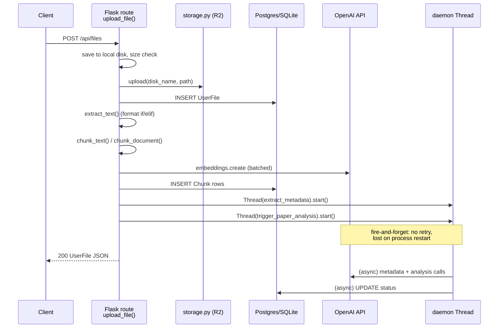
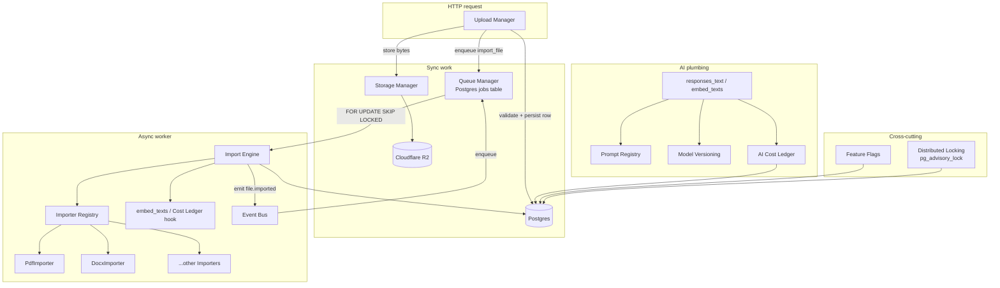
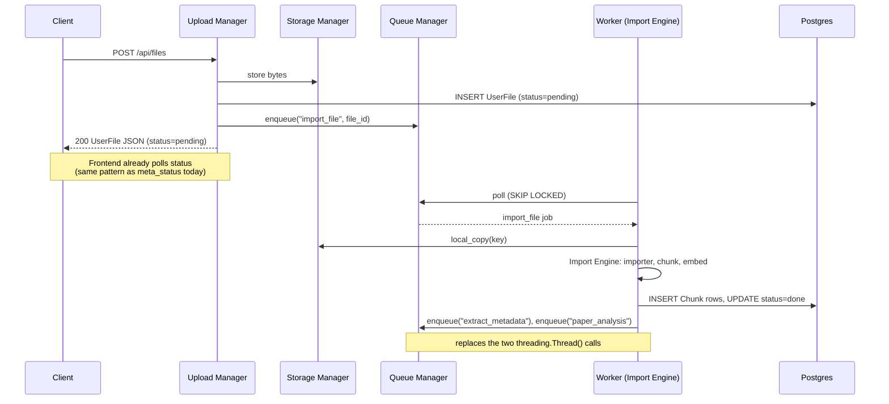

# Upload System — Architecture & Audit (Foundation Phase)

Scope: audit the current upload/import pipeline in `server.py` + `storage.py`,
define the target component architecture, and lay out a migration strategy.
No implementation in this document — definitions and diagrams only.

---

## 1. Current system audit

Everything lives in one 4,779-line `server.py` (Flask app, SQLAlchemy models,
every route, every background job) plus a 65-line `storage.py` (R2 client).
There is no package structure — routes, models, prompts, and business logic
are all module-level functions in the same file.

### 1.1 Upload request flow today

`POST /api/files` (`server.py:1528-1655`) does all of the following
**synchronously, in the request thread**:

1. Save the multipart upload to local disk (`UPLOAD_DIR`).
2. Size-check against `MAX_UPLOAD_BYTES`.
3. Upload the bytes to Cloudflare R2 (`storage.upload`).
4. Insert a `UserFile` row.
5. If `kind == "document"`: dispatch to `extract_text()`, which if/elif-chains
   on file extension to one of `_extract_pdf` / `_extract_docx` /
   `_extract_pptx` / `_extract_xlsx` / `_extract_zip` (recursive) /
   `_read_text_file` — legacy `.doc`/`.ppt`/`.xls` return a canned
   "re-save as X" note instead of being parsed.
6. Chunk the extracted text — `chunk_document()` (page/section-aware, used
   for PDF/DOCX) or `chunk_text()` (flat, everything else).
7. Call `embed_texts()` — batches of 64 into `client.embeddings.create`.
8. Write one `Chunk` row per piece, commit.
9. Fire two **daemon threads**, fire-and-forget: `extract_metadata()`
   (bibliographic fields) and `trigger_paper_analysis()` (14-field summary).
10. Return the `UserFile` JSON to the client.

Images (`kind == "image"`) skip 5-9 entirely and are later sent as vision
input directly from R2.

### 1.2 What "async" means today

Four call sites use the identical pattern —
`threading.Thread(target=..., daemon=True).start()`:
metadata extraction, paper analysis (`server.py:1244-1330`), memory
extraction (`:3719`), and comparison/gap-finder jobs (`:4170`, `:4402`).

Consequences, confirmed by reading the code, not assumed:

- **No persistence.** If the process restarts mid-job, the thread is gone
  and no record says the job needs retrying — the row is stuck at
  `status = "running"` forever.
- **No retry/backoff.** A transient OpenAI error marks `status = "failed"`
  and stops; a human has to click "refresh" to try again.
- **No cross-process coordination.** The README's own deploy instructions
  (`gunicorn -w 2`) would let two workers both pick up the same upload
  and duplicate the model calls — nothing prevents it.
- **Idempotency is hand-rolled per feature.** `UserFile.content_hash` +
  `meta_status`, and `PaperAnalysis.content_hash` + `status`, each
  reimplement the same "skip if already done for this hash" check.

### 1.3 Concurrency primitives that only work in one process

- `_model_lock = threading.Lock()` (`:174`) guards the model-list cache —
  correct in one process, silently ineffective across workers.
- `flask_limiter` rate limiter uses `storage_uri="memory://"`
  (`:146-148`) — the code comment already says *"switch to redis:// for
  multi-process production"*, i.e. this is a known, already-flagged gap.

### 1.4 Prompts, models, cost — none of this is tracked

- Prompts (`_META_PROMPT`, `_ANALYSIS_PROMPT`, the chat system prompt, the
  compare/gap-finder prompts) are plain module-level string constants,
  inlined beside the function that uses them. No version number, no
  changelog, no way to know which prompt wording produced a stored row.
- Model choice is an env var (`UTILITY_MODEL`, `DEFAULT_MODEL`) baked in at
  process start. `PaperAnalysis.model` records which model produced a row,
  but **not** which prompt version — editing a prompt doesn't invalidate
  cached analyses, only editing the *document* does (via `content_hash`).
- Token usage from every `client.responses.create` / `embeddings.create`
  call is read for its text and otherwise discarded. Zero cost visibility.
- No feature-flag mechanism exists at all; behavior changes require an env
  var change and a redeploy.

### 1.5 Retrieval scales linearly, not an indexing problem today

`rag_retrieve()` (`:923-981`) loads **every chunk** for a user's in-scope
files into Python and computes cosine similarity in a loop — no vector
index (no pgvector, no FAISS). Fine at hundreds of chunks per user; will
degrade linearly as a library grows. Flagging this because "Storage
Manager" / "Import Engine" is the natural place a future index would plug
in, not because it needs fixing now.

### 1.6 Migrations

`ensure_columns()` (`:434-486`) runs a hardcoded list of
`ALTER TABLE ... ADD COLUMN`, each wrapped in try/except to swallow the
"already exists" error, plus a list of `CREATE INDEX IF NOT EXISTS`. Run on
every process boot. No Alembic, no down-migrations, no migration-history
table — append-only by convention.

### 1.7 What's actually already good (don't touch)

- `storage.py` — small, single-purpose R2/S3 wrapper (`upload` / `delete` /
  `presigned_url` / `local_copy`). This is already what a Storage Manager
  should look like internally.
- One upload endpoint serves both Knowledge Library uploads and chat
  attachments (`conversation_id` is just optional) — no duplicated upload
  path to reconcile.
- The `content_hash`-gated idempotency *idea* is correct, just duplicated
  per feature instead of centralized.
- `requirements.txt` has no queue/broker dependency (no Celery, no Redis,
  no RQ) — the system has stayed genuinely simple so far. The target
  architecture should keep it that way where it can.

---

## 2. Reuse map

What the new components are built *from*, not built *instead of*:

| Existing code | Becomes |
|---|---|
| `storage.py` (boto3/R2 wrapper) | The implementation inside the new **Storage Manager** — unchanged |
| `_extract_pdf/_docx/_pptx/_xlsx/_zip`, `_read_text_file`, `_sniff_text` | Individual **Importer** implementations behind the new interface |
| `extract_text()`'s if/elif chain | Replaced by the Importer **registry** (extension → importer lookup) |
| `chunk_text()` / `chunk_document()` | Unchanged, called by the **Import Engine** after an Importer runs |
| `embed_texts()` | Unchanged, called by the Import Engine; also the natural hook for the **Cost Ledger** |
| `content_hash` + per-feature `status` columns | Generalized into the **Queue Manager**'s job-row shape |
| Postgres (already the prod DB, via Neon) | Doubles as the **Queue Manager** table backend *and* the **Distributed Locking** primitive (`pg_advisory_lock`) — instead of adding Redis/Celery |
| `threading.Thread(daemon=True)` call sites (4 of them) | Replaced 1:1 by `queue.enqueue(...)` calls |
| `responses_text()` / `embed_texts()` | Stay the single choke points; Prompt Registry, Model Versioning, and Cost Ledger all hang off these two functions rather than each call site |

The single biggest call in this plan: **do not add Redis, Celery, or a
message broker.** Postgres is already in every deployment target and covers
the Queue Manager, the distributed lock, and (if ever needed) feature
flags. Add real infrastructure only when a documented ceiling below is
actually hit.

---

## 3. Target components

### 3.1 Import Engine

Pure orchestration, no HTTP, no route awareness. Given a local file path +
mime + name:

1. Resolve an **Importer** from the registry.
2. `importer.extract(path, mime, name)` → text + optional locators.
3. Chunk (`chunk_document` if the importer supports locators, else
   `chunk_text`).
4. `embed_texts()` on the pieces.
5. Return `(chunks, note)` to the caller — it does not write to the DB
   itself, so it stays unit-testable without a database.

### 3.2 Importer interface

```
Importer:
  extensions: tuple[str, ...]        # e.g. (".pdf",)
  supports_locators: bool            # can attach page/section per chunk?
  extract(path, mime, name) -> ExtractResult

ExtractResult:
  text: str                          # "" = no readable text (e.g. scanned PDF)
  note: str | None                   # bracketed-style human note, replaces
                                     # today's "[...]" convention in extract_text()
  locators: list[Locator] | None     # only when supports_locators
```

Concrete implementers, one per current `_extract_*` function:
`PdfImporter`, `DocxImporter`, `PptxImporter`, `XlsxImporter`,
`ZipImporter` (recurses through the registry, same depth cap as today),
`TextImporter` (the `TEXT_EXT` whitelist), `LegacyOfficeImporter` (returns
the existing "re-save as .docx/.pptx/.xlsx" note — still doesn't attempt to
parse `.doc`), `ImageImporter` (no text; marks the file for the vision path
instead of a parallel `kind == "image"` branch ahead of the registry).

The **registry** resolves by extension first, falling back to mime sniff —
mirroring today's `_sniff_text()` fallback for unrecognized extensions.

### 3.3 Storage Manager

1:1 wrap of today's `storage.py` — `upload` / `delete` / `presigned_url` /
`local_copy`. No functional change. Formal rule: nothing outside this
module calls `boto3` directly. Keeps the existing (correct) behavior of
reusing the local temp copy for extraction instead of re-downloading from
R2 right after uploading to it.

### 3.4 Upload Manager

The HTTP-facing component — and *only* the HTTP-facing concerns. Today's
`upload_file()` does validation, storage, extraction, chunking, embedding,
and thread-spawning all in one function. The Upload Manager narrows to:

1. Validate the request (file present, size limit, `kind` classification).
2. Persist the `UserFile` row as `status = "pending"`.
3. Hand bytes to the Storage Manager.
4. `queue.enqueue("import_file", {file_id, ...})`.
5. Return the row immediately — extraction/chunking/embedding no longer
   block the HTTP response even for the *first* piece of work, not just
   the metadata/analysis follow-ups as today.

### 3.5 Queue Manager

A Postgres-backed job table, no new infrastructure:

```
jobs
  id            bigserial primary key
  kind          text            -- 'import_file' | 'extract_metadata' | ...
  payload       jsonb
  status        text            -- pending | running | done | failed
  attempts      int default 0
  run_after     timestamptz     -- for backoff scheduling
  locked_by     text            -- worker id, null when unlocked
  locked_at     timestamptz
  last_error    text
  created_at    timestamptz
  updated_at    timestamptz
```

Worker loop: poll with
`SELECT ... FROM jobs WHERE status='pending' AND run_after<=now() ORDER BY id FOR UPDATE SKIP LOCKED LIMIT 1` —
the standard Postgres queue pattern. Safe with multiple workers because of
`SKIP LOCKED`; survives process restart because the row itself is the
source of truth, not memory.

Replaces every current `threading.Thread(daemon=True).start()` call site.
Gains over today: retry with backoff, a `SELECT * FROM jobs WHERE
status='failed'` view for free, and correctness under the `gunicorn -w 2`
deployment the README already recommends.

**Ceiling:** fine into the thousands-of-jobs/day range on a shared
Postgres instance. Upgrade path — swap the backend behind the same
`enqueue()` / worker-loop interface for Redis or SQS — is an implementation
swap, not a rewrite of call sites, if volume or latency ever outgrows it.

### 3.6 Event Bus

In-process pub/sub, not a broker: `on(event, handler)` / `emit(event,
payload)` over a plain `dict[str, list[Callable]]`. Lets `"file.uploaded"`
trigger metadata extraction *and* paper analysis *and* (later) anything
else without `upload_file()` naming every consumer by hand, which is what
happens today (`extract_metadata()` and `trigger_paper_analysis()` are both
called directly, by name, inside the upload route).

**Ceiling:** single-process only. Doesn't help two server processes react
to the same event — the Queue Manager already covers that case, since a
job row is valid across processes. Upgrade path: once cross-process fan-out
is needed, move the bus's `emit()` to enqueue N jobs instead of calling N
in-process handlers — a natural extension, not a redesign.

### 3.7 Prompt Registry

Every current `_XXX_PROMPT` string constant becomes a named, versioned
entry:

```
PromptVersion: name, version, template, model_hint
```

Simplest viable form at current scale: one `prompts.py` module holding
`{"paper_analysis": [PromptVersion(1, ...), PromptVersion(2, ...)]}`,
"latest" = last entry. No DB table, no admin UI — those are the documented
upgrade path, not the starting point.

**Upgrade path:** move to a DB table the day someone needs to edit a prompt
without a deploy, or A/B test two versions live.

### 3.8 Model Versioning

Every AI-generated row already stores which `model` produced it
(`PaperAnalysis.model`); add `prompt_version` alongside it (from 3.7) so
"is this row stale" can be driven by prompt changes too, not only by
`content_hash` (input changed). A small
`CURRENT_VERSIONS = {"paper_analysis": (UTILITY_MODEL, 3)}` lookup extends
the existing idempotency check — shipping a better prompt then
auto-invalidates old cached analyses next time they're viewed, which isn't
possible today.

### 3.9 AI Cost Ledger

One append-only table:

```
ai_calls
  id                bigserial primary key
  user_id           int
  kind              text     -- chat | embedding | metadata | analysis | ...
  model             text
  prompt_tokens     int
  completion_tokens int
  cost_usd          numeric
  created_at        timestamptz
```

Written from exactly the two existing choke points — `responses_text()`
and `embed_texts()` — using a small static price-per-model table (updated
by hand when OpenAI changes pricing; no billing-API integration needed at
this scale). This is the one deliverable that's pure addition: usage data
exists in every OpenAI response today and is currently thrown away, so
there's nothing to migrate, only something to stop discarding.

### 3.10 Feature Flags

`feature_flags` table — `{flag: text, enabled: bool, user_id: int nullable}` —
behind one helper, `flag_on(name, user=None)`. Reuses Postgres rather than
adding LaunchDarkly/Unleash.

**Explicit recommendation: defer this.** Build it when the migration below
actually needs a kill switch (e.g. rolling the new queue-based upload path
out to a subset of users first), not speculatively ahead of that need.

### 3.11 Distributed Locking strategy

Postgres advisory locks (`pg_try_advisory_lock(hashtext(key))`) for the
one thing that genuinely assumes a single process today: the model-list
cache refresh (`_model_lock`). "Only one worker runs this job" is already
solved by the Queue Manager's `FOR UPDATE SKIP LOCKED` — it does not need a
separate locking mechanism. No Redis/ZooKeeper: Postgres (Neon) is already
the one datastore every deployment target has.

---

## 4. Architecture diagrams

### 4.1 Current upload flow (synchronous, single process)



### 4.2 Target architecture (components)



### 4.3 Target upload flow (sequence)



---

## 5. Folder structure

Proposed package layout, replacing the single `server.py`. Flask
blueprints throughout — no framework change, just module boundaries:

```
backend/
  app.py                     # Flask app factory, blueprint registration
  extensions.py              # SessionLocal, oauth, limiter, OpenAI client
  models/
    core.py                  # User, Project, Conversation, Message, Memory
    library.py                # UserFile, Chunk, PaperAnalysis, DerivedAnalysis
    citations.py
    ops.py                     # jobs, ai_calls, feature_flags tables
  storage/
    manager.py                 # Storage Manager (today's storage.py, moved)
  imports/
    engine.py                   # Import Engine
    interface.py                  # Importer protocol, ExtractResult, Locator
    registry.py                    # extension/mime -> Importer resolution
    importers/
      pdf.py  docx.py  pptx.py  xlsx.py  zip.py  text.py
      image.py  legacy_office.py
  uploads/
    manager.py                       # Upload Manager
    routes.py                         # /api/files blueprint
  queue/
    manager.py                         # enqueue() + worker loop
    jobs/
      import_file.py
      metadata_extraction.py
      paper_analysis.py
      memory_extraction.py
      compare.py
      gap_finder.py
  events/
    bus.py                               # in-process pub/sub
  ai/
    client.py                              # responses_text / embed_texts (today's choke points)
    prompts.py                              # Prompt Registry
    versioning.py                            # CURRENT_VERSIONS lookup
    cost_ledger.py                            # ai_calls writer + price table
  flags/
    manager.py                                 # flag_on() helper
  locking/
    advisory.py                                 # pg_advisory_lock helpers
  routes/                                        # everything else currently
    auth.py  chat.py  notes.py  citations.py       # inline under server.py
    projects.py  conversations.py  analysis.py
    export.py  support.py  memories.py
```

---

## 6. Component responsibilities (summary table)

| Component | Responsibility | Depends on | Replaces today |
|---|---|---|---|
| Storage Manager | Bytes in/out of R2 | boto3 | `storage.py` (unchanged, moved) |
| Importer (×N) | One format → text + locators | format libraries (PyMuPDF, python-docx, ...) | `_extract_pdf` etc. |
| Importer Registry | Resolve file → Importer | Importers | `extract_text()`'s if/elif chain |
| Import Engine | Orchestrate extract → chunk → embed | Registry, `chunk_*`, `embed_texts` | Inline steps 5-8 of `upload_file()` |
| Upload Manager | HTTP validation + kick off import | Storage Manager, Queue Manager | `upload_file()` (narrowed) |
| Queue Manager | Durable, retryable async jobs | Postgres | 4× `threading.Thread(daemon=True)` |
| Event Bus | Decouple "upload happened" from "who reacts" | in-process only | Direct function calls in `upload_file()` |
| Prompt Registry | Named, versioned prompt templates | none (module or table) | `_META_PROMPT` / `_ANALYSIS_PROMPT` etc. |
| Model Versioning | Know which model+prompt produced a row | Prompt Registry | `PaperAnalysis.model` alone |
| AI Cost Ledger | Track token usage & cost per call | `responses_text` / `embed_texts` | Nothing (net-new) |
| Feature Flags | Runtime behavior toggles | Postgres | Env vars + redeploy (deferred — build on demand) |
| Distributed Locking | Cross-process mutual exclusion | Postgres advisory locks | `threading.Lock()` (`_model_lock`) |

---

## 7. Migration strategy (incremental, no big-bang rewrite)

Each phase leaves the app fully runnable and deployable — strangler-fig,
not a long-lived branch:

1. **Phase 0** — Add the Queue Manager (`jobs` table + worker loop) and
   Storage Manager module as pure additions. Existing
   `threading.Thread` call sites untouched; both coexist.
2. **Phase 1** — Introduce the Importer interface + registry; move each
   `_extract_*` function in verbatim as its first Importer implementation
   (behavior-identical refactor).
3. **Phase 2** — Switch `upload_file()`'s inline extract/chunk/embed into
   an enqueued `import_file` job. The frontend already polls a status field
   (`meta_status`/analysis `status` pattern) — only needs a `"pending"`
   state added to the initial upload response, not a rewrite.
4. **Phase 3** — Replace the remaining 3 `threading.Thread` call sites
   (metadata, paper analysis, memory extraction, compare/gaps) with Queue
   Manager jobs, one at a time, each independently shippable and
   revertable.
5. **Phase 4** — Additive instrumentation: Event Bus over the jobs an
   upload enqueues, Prompt Registry + Model Versioning + Cost Ledger around
   the two existing AI choke points, Distributed Locking for the model
   cache. Feature Flags only when the first real flag is needed.
