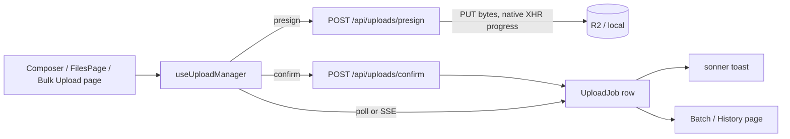

# User Experience — Upload UI Architecture

Scope: the frontend, finally — everything docs 1-8 designed on the
backend needs somewhere to surface. Design only, same format as the rest
of the series.

**Audit of what exists today**: `Composer.tsx` (chat attach) and
`FilesPage.tsx` (library upload) each run their **own, independent**
upload logic — no shared code between them. Progress is a boolean spinner
(`ComposerAttachments.tsx`: `f.uploading ? <Loader2 spin /> : ...`), not a
percentage. There's no cancel, no retry, no history, no queue view, no
admin page — `/admin` isn't in the router at all. Most of what these 10
deliverables need is **consolidating two duplicated upload paths into one
shared layer**, then wiring that layer to what docs 2-8 already designed
— not inventing new interaction patterns from nothing. Two things already
in the codebase get reused directly: `sonner` (already the toast library,
already used for upload success/warning/error) and
`MultiPaperAnalysisPage`'s existing multi-file list UI (the closest
existing analog to a batch view).

---

## 1. Upload Manager UI — the foundation everything else builds on

A single `useUploadManager()` hook (React Context, consistent with how
`UIContext` already works in this codebase), replacing the two separate,
duplicated upload implementations in `Composer.tsx` and `FilesPage.tsx`.
Owns:

- The presign → PUT → confirm orchestration against the routes the
  storage-implementation pass already built
  (`/api/uploads/presign`, `/api/uploads/confirm`,
  `/api/uploads/multipart/complete`) — today only the legacy
  `/api/files` proxy path is wired into the UI at all; this is also where
  that gets connected.
- In-flight upload state: one entry per file, keyed by the backend's
  `UploadJob` id once assigned.
- Cancel/retry actions (§6), each a thin call to the corresponding
  backend endpoint.

Both existing consumers (`Composer.tsx`, `FilesPage.tsx`) become thin —
they call `useUploadManager().upload(files)` and render whatever it
returns, instead of each maintaining its own `pending` state array and
its own `filesApi.upload()` loop.

---

## 2. Bulk Upload page

`Composer.tsx` already has real folder-drop handling —
`IGNORE_PATH` (skips `node_modules`/`.git`/build dirs),
`MAX_FOLDER_FILES` cap, `fromFolder` filtering. That logic is chat-scoped
today; lifted into the Upload Manager (§1), it becomes available to a new
dedicated page (`/uploads/new`) for the actual bulk case — select or drop
50 files, watch them all process, without a chat conversation in the way.
No new file-filtering logic — the existing folder-drop rules just stop
being duplicated the next time this is needed somewhere new.

---

## 3. Progress UI — two phases, not one blended number

Today: spinner or not. Real percentage now has two genuinely different
sources and shouldn't be faked as one number:

- **Upload phase** — bytes sent to the presigned URL. The browser's
  native `XMLHttpRequest.upload.onprogress` gives this for free, no
  library — `fetch()` doesn't expose upload progress, which is the one
  reason this specific call uses `XHR` instead of the `fetch()` calls
  used everywhere else in this codebase.
- **Processing phase** — the Step Runner's checkpoint
  (`processing-pipeline-architecture.md` §5, e.g. `{"embedded_count": 40,
  "total_pieces": 100}`), read via the polling contract
  (`api-contract.md` §6) or pushed via SSE (§7 of that doc).

Rendered as one bar with two labeled segments — *"Uploading 80%"* then
*"Processing 40%"* — rather than averaging bytes-sent and chunks-embedded
into a single meaningless percentage.

---

## 4. Queue UI

A quick-glance panel (TopBar dropdown, not a full page) — "what's
in-flight right now" for the current user, sourced from the same
`UploadJob`/`UploadBatch` rows and the same polling contract as
Progress UI (§3). Deliberately not a page of its own — its job is a
glance, not a destination; drilling into any one item routes to the
Batch page (§5) for detail.

---

## 5. Batch page (and Upload History — same page, a status filter)

Detail view for one `UploadBatch`: the list of files in it, each with its
own status. Reuses `MultiPaperAnalysisPage`'s existing file-list rendering
as the visual template — that page already solved "render a list of
files with per-file state," no need for a second implementation of the
same layout.

**Upload History is this same page with a filter, not a separate one.**
A "batch I'm looking at right now" view and "all my past batches" view
differ only by which `UploadBatch` rows are in scope
(`status='running'` vs. everything, `?status=` query param) — building
them as two separate pages/components would be the exact kind of
duplication this whole doc's audit opened by flagging in the *current*
Composer/FilesPage split. One page, one status filter.

---

## 6. Retry UI

Surfaces the user's own `status='failed'` jobs — the dead-letter queue
from `processing-pipeline-architecture.md` §7 — with a Retry button per
job. Scoped to **the requesting user's own jobs only**
(`api-contract.md` §8's ownership-check convention: filter-in-query,
`WHERE user_id = :uid AND status = 'failed'`), calling a
requeue endpoint that resets `status='pending', attempts=0`. Distinct
from the Admin pages' (§10) DLQ view, which needs to requeue *across*
users — same underlying mechanism, different scope, not two different
retry systems.

---

## 7. Notifications

**Reuse `sonner`, already installed and already used** for the existing
upload toasts (`toast.success`, `toast.warning`, `toast.error` in
`Composer.tsx`) — no new toast library. What's missing is coverage: today
those fire only synchronously, right after the initial HTTP call
returns. Once processing is async (poll/SSE per `api-contract.md` §6-7),
a toast should also fire **later** — "Paper Analysis complete" or
"Upload failed after 3 retries" — sourced from the exact same
poll/SSE stream Progress UI (§3) already consumes, not a second
notification pipe.

A small **notification center** (bell icon, last N events) covers the
case a toast alone can't: the user wasn't looking when it finished. No
new table — it's a query over recently-completed `UploadJob`/
`UploadBatch` rows, the same data the Batch/History page (§5) already
renders, just filtered to "recent" and rendered as a dropdown instead of
a page.

---

## 8. ETA

Two data sources, combined so the very first second of a job isn't
blank:

- **Cold start** (no progress yet on *this* job): the historical average
  duration for this `job_type` (and roughly this file size), read from
  `processing_metrics_daily` (`database-design.md` §2.3 /
  `devops-observability.md` §3's materialized-view pattern) — "papers
  this size usually take ~40s."
- **Warm** (checkpoint data exists): linear extrapolation from the
  in-job checkpoint — `embedded_count / total_pieces` against elapsed
  time so far, which becomes more accurate than the historical average as
  the job progresses and should take over from it once available.

No new table for this — both numbers already exist from earlier docs;
this is just the formula that blends them.

---

## 9. Upload history

Covered in §5 — the Batch page with a status filter, not a separate
build.

---

## 10. Admin pages

The frontend for `devops-observability.md` §9's Admin Dashboard design —
that doc already specified the six tabs (Queue, Workers, Storage, Cache,
AI Cost, Performance); this is just their concrete routes
(`/admin/queue`, `/admin/workers`, …) and the one thing worth stating
explicitly on the frontend side: **gating is defense in depth, not the
primary control.** The `ADMIN_EMAILS` check (`devops-observability.md`
§9) happens server-side on every admin API call — the frontend hides the
`/admin` nav entry for non-admin users and shows a plain 403 page if
someone navigates there directly, but never relies on the hidden link
itself as the security boundary.

---

## 11. Summary

| Consolidation (removes duplication) | New UI, existing backend data | Reused as-is |
|---|---|---|
| Upload Manager UI unifies Composer + FilesPage (§1) | Progress UI two-phase bar (§3) | `sonner` for notifications (§7) |
| Batch page = Upload History with a filter (§5, §9) | Queue UI panel (§4) | `MultiPaperAnalysisPage` list layout (§5) |
| | Retry UI, ETA (§6, §8) | Admin tab designs from `devops-observability.md` (§10) |

Same close as the rest of the series: design only — say the word for the
implementation pass.
